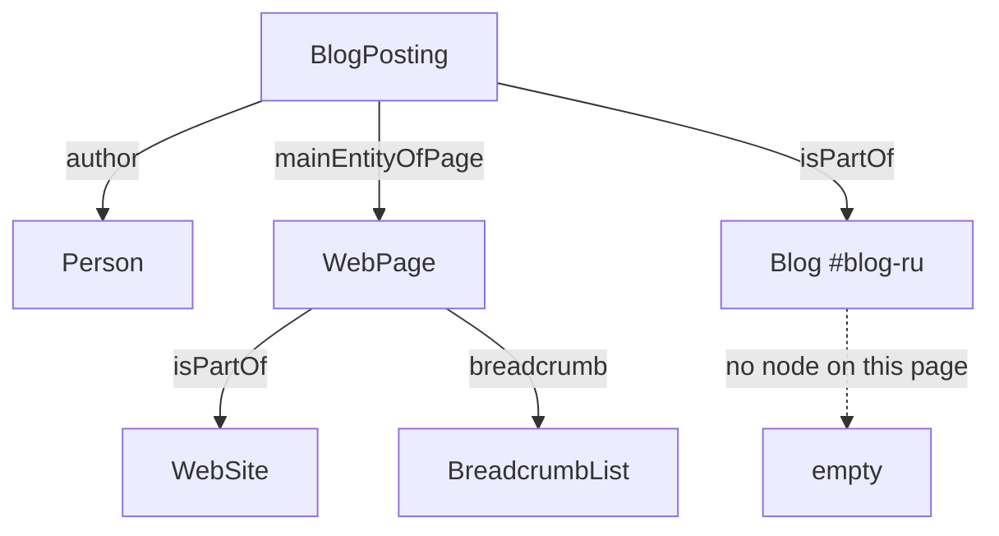

> Every article on this site carried a link into the void. The `BlogPosting` node referenced a blog node through `isPartOf` that didn't exist on the article page. Neither Schema Markup Validator nor Rich Results Test said a word about it, because for them it isn't an error. I look at how to build a graph so that things like this get caught, what's safe to use for inserting JSON inside a `script`, and what markup actually gives you versus what gets attributed to it.

---

## 1. What `@graph` means according to the spec

An article has an author, a site, and an address of its own. When this information is assembled by separate components, it's easy to end up with two authors at different URLs, or an update date that doesn't match what's visible on the page. A graph is convenient precisely because such discrepancies stand out.

It's worth knowing what `@graph` formally means. When a document's top level has no keys other than `@graph` and an optional `@context`, the JSON-LD 1.1 spec treats it this way: "`@graph` is considered to express the otherwise implicit default graph." In other words, it's not a named graph or a special construct — just a plain set of nodes sharing a context. The spec states the practical benefit directly: "a top-level map with a `@graph` property can be useful for saving the repetition of `@context`."

So here's the honest way to put it: a single graph is a decision about maintainability, not a requirement. Several separate, correct JSON-LD blocks on a page are also fine — Google describes both approaches and calls neither preferred.

A shortened example of the relationships:

```json
{
  "@context": "https://schema.org",
  "@graph": [
    { "@type": "Person", "@id": "https://artka.dev/#person", "name": "Artyom Kashuta" },
    {
      "@type": "WebSite",
      "@id": "https://artka.dev/#website",
      "url": "https://artka.dev/",
      "name": "artka.dev"
    },
    {
      "@type": "WebPage",
      "@id": "https://artka.dev/blog/example/#webpage",
      "url": "https://artka.dev/blog/example/",
      "isPartOf": { "@id": "https://artka.dev/#website" }
    },
    {
      "@type": "BlogPosting",
      "@id": "https://artka.dev/blog/example/#article",
      "author": { "@id": "https://artka.dev/#person" },
      "mainEntityOfPage": { "@id": "https://artka.dev/blog/example/#webpage" }
    }
  ]
}
```

Invariant: the page address in the graph, in the canonical tag, in the sitemap, and in internal links must denote the same URL form. On this site, that's a trailing slash. The English version has its own address under `/en/`; languages are connected through hreflang, not by swapping the canonical for the Russian original.

Speaking of the two language versions: Google has a separate directive that applies directly here: "If you have duplicate pages for the same content, we recommend placing the same structured data on all page duplicates, not just on the canonical page."

---

## 2. What Google actually reads, and where

The most common misconception goes like this: let's put all entities on every page, it can't hurt. It really can't hurt — but some of them won't do any good there either.

| Type         | Required properties    | Where Google reads it                                         |
| ------------ | ---------------------- | ------------------------------------------------------------- |
| Article      | none                   | on the article page                                           |
| Person       | `name` inside `author` | as the article's author, and as `mainEntity` on a ProfilePage |
| ProfilePage  | `mainEntity`           | on the author page or an "about" page                         |
| WebSite      | none required          | only on the homepage of the domain or subdomain               |
| Organization | none required          | on the homepage or on one page about the organization         |

It's worth quoting Article verbatim, because it changes the tone of the whole conversation: "There are no required properties; instead, add the properties that apply to your content." This isn't about meeting requirements — it's about supplying as many relevant properties as you have.

Recommended for Article: `author`, `author.name`, `author.url`, `datePublished`, `dateModified`, `headline`, `image`. The type must be one of three: Article, NewsArticle, or BlogPosting.

There's an important caveat about WebSite: Google reads the site-name markup only on the homepage, and asks you not to duplicate the block there either. Verbatim: "avoid creating an additional `WebSite` structured data block on your home page if you can help it." In an article's graph, the WebSite node is only an anchor point for `isPartOf` to attach to — not a claim to a site name.

Dates deserve their own note. Google has a page specifically about them, and the requirement there cuts both ways: add a visible date, label it in words, and "Ensure that the date (and optional time and timezone) match between the equivalent user-visible and structured values." Plus the advice: "Minimize the presence of other dates on the page." In other words, checking that "the publication date hasn't changed" is incomplete without also checking that "the date in the markup matches the date on screen."

A useful detail from Google's own ProfilePage example: Person and Article are linked through `@id` there, using a relative fragment, `#main-author`, rather than an absolute address. An absolute identifier is more robust when documents get merged, but you can't say the relative one is wrong.

---

## 3. The bug no validator catches

Now for the thing this post started with.

On every article page, the `BlogPosting` node referenced a blog node through `isPartOf`, using the identifier `https://artka.dev/#blog-ru`. That node itself was only output on `/blog/`. The result looked like this:



The article's only link to the publication didn't resolve on a single article, in either language. Exactly the thing the graph was supposed to be for.

Why the validators stayed silent. The JSON-LD 1.1 spec defines a node reference this way: "A node reference is a node object containing only the `@id` property, which may represent a reference to a node object found elsewhere in the document." The key word is "may." If no node with that identifier exists in the document, you get a valid but empty node: an address with no properties. That's not an error by the spec, and not an error by Google's rules either.

A similar story turned up on project pages: the collection had no `breadcrumb` field even though breadcrumbs were rendered on the page, and the project page had no `mainEntity`, so the description of the work just hung there on its own.

The conclusion is simple. Validators check each node in isolation, and nobody checks the graph's connectivity. So you have to check it yourself, and that's a half-hour job (section 7).

---

## 4. What's a violation, and what's just useless

The difference between these two categories matters, and it's worth keeping in mind, because one carries a manual action and the other carries nothing at all.

| What                                         | Violation? | What happens                                                  |
| -------------------------------------------- | ---------- | ------------------------------------------------------------- |
| Markup for content invisible to the reader   | yes        | manual action, loss of eligibility for rich results           |
| Misleading markup                            | yes        | same                                                          |
| Impersonating another person or company      | yes        | same                                                          |
| Outdated, unsupported markup                 | no         | no effect, no errors in reports                               |
| Dangling `@id` reference                     | no         | a valid, empty node, of zero use                              |
| Two Person nodes with different `@id` values | no         | two distinct entities, the search engine decides              |
| Microdata and JSON-LD on the same page       | no         | not forbidden by the rules, but the entities will drift apart |

On violations, Google is direct: "Don't mark up content that is not visible to readers of the page. For example, if the JSON-LD markup describes a performer, the HTML body must describe that same performer." The consequence of the action is also stated precisely: "A structured data manual action means that a page loses eligibility for appearance as a rich result; it doesn't affect how the page ranks in Google web search."

That's the only item on the list that Google calls a violation. Everything else doesn't qualify, and there's no need to scare yourself over it.

Mixing formats needs a careful note: there's no ban, Google supports JSON-LD, microdata and RDFa, and nowhere forbids combining them. The risk isn't a penalty — it's ending up with two independent copies of the same entity that will drift apart at the first edit. On my article page, the byline under the headline was marked up with microdata and created a second Person entity with no address and no links, while a complete one already lived in JSON-LD. The search engine saw two different people on the same page.

---

## 5. Safe insertion: two schools of thought, and a real vulnerability

The HTML standard describes constraints on the content of a `script` element and gives direct advice: "always escape an ASCII case-insensitive match for "`<!--`" as "`\x3C!--`", "`<script`" as "`\x3Cscript`", and "`</script`" as "`\x3C/script`" when these sequences appear in literals in scripts."

Note that there are three dangerous sequences, not one, and the match is case-insensitive — so `</ScRiPt` will also close the element early.

The `application/ld+json` type makes the element a data block that the browser won't execute, but parsing the content doesn't depend on the type. The constraints apply the same way regardless.

This is where a fork appears that usually goes unmentioned.

**Approach one, by the letter of the JSON-LD spec.** Its section on embedding in HTML is marked non-normative and advises replacing five characters with named entities:

```ts
const ENTITIES: Record<string, string> = {
  "&": "&amp;",
  "<": "&lt;",
  ">": "&gt;",
  '"': "&quot;",
  "'": "&apos;",
};

export const safeJsonLdEntities = (value: unknown): string =>
  JSON.stringify(value).replace(/[&<>"']/g, (c) => ENTITIES[c] ?? c);
```

This is exactly how Google's own `react-schemaorg` library does it, with a comment linking to this very section. But the approach has a cost, and the spec names it honestly: "the content will remain escaped after processing through the JSON-LD API." That means the parsed value will keep `&lt;` instead of `<`. The spec's own example plays out exactly that way.

**Approach two, through JSON's own built-in escaping.**

```ts
export const safeJsonLd = (value: unknown): string =>
  JSON.stringify(value)
    .replace(/</g, "\\u003c")
    .replace(/>/g, "\\u003e")
    .replace(/&/g, "\\u0026")
    .replace(/
/g, "\\u2028")
    .replace(/
/g, "\\u2029");
```

The `<` sequence is ordinary JSON escaping that parses back into the original character. In the page's bytes, `</script` and `<!--` never occur, and the value stays exact. Formally this isn't what the non-normative section describes, but it doesn't contradict it either.

The difference, for a string containing `</script>`:

| Approach       | In HTML           | After parsing     |
| -------------- | ----------------- | ----------------- |
| Named entities | `&lt;/script&gt;` | `&lt;/script&gt;` |
| `<`            | `</script>`       | `</script>`       |

For a technical blog, where fragments of HTML show up in the markup's text, the second approach is more practical. The choice is worth making consciously, not silently.

That this isn't theoretical is confirmed by the history of the `google/react-schemaorg` library. Issue number nine, filed March 16, 2020: on server-side rendering, the data landed in the HTML unescaped, and a value like `</script><script>alert('xss')</script>` broke out of the block. From the description: "There's a potential XSS problem when using this library with server-side-rendering (which is arguably one of the most prominent use-cases to render json-ld)." The issue was closed and escaping was added.

This matters especially in Astro, because the `set:html` directive deliberately escapes nothing. The documentation warns directly: "The value is not automatically escaped by Astro! Be sure that you trust the value, or that you have escaped it manually before passing it to the template," and "Forgetting to do this will open you up to Cross Site Scripting (XSS) attacks."

The correct call looks like this:

```astro
<script type="application/ld+json" set:html={safeJsonLd(graph)} />
```

Concatenating strings from frontmatter into the template doesn't cut it here.

---

## 6. Three tools, three different checks

Valid JSON, correct Schema.org markup, and eligibility for a specific search format are three different things, and they're checked in three different ways.

| Tool                    | What it checks                                    | What it doesn't do                              |
| ----------------------- | ------------------------------------------------- | ----------------------------------------------- |
| Schema Markup Validator | any Schema.org markup, independent of Google      | doesn't give Google-specific warnings           |
| Rich Results Test       | only the types Google supports for display        | doesn't check arbitrary Schema.org markup       |
| URL Inspection          | how Google sees a specific address on a live site | not a markup validator, requires site ownership |

Schema Markup Validator is the former Google Structured Data Testing Tool, which had its Google-specific checks removed and was handed over to the Schema.org community. One specific quirk: it doesn't pull in third-party contexts — "in the case of JSON-LD, this means that it will not fetch or interpret other @context URLs."

Rich Results Test works off rendered code — that is, it executes scripts — and requires that all page resources be accessible to an anonymous visitor: "All page resources must be accessible by an anonymous user accessing the code from the internet." If resources fail to load, results will bounce around from run to run.

Google's own Article guide names three steps, not two: check with Rich Results Test, publish a few pages, and look them up with URL Inspection — because the test and the live index are different things.

And an honest boundary worth keeping in mind: "Google does not guarantee that your structured data will show up in search results, even if your page is marked up correctly according to the Rich Results Test." One of the listed reasons is: "The structured data is incorrect in a way that the Rich Results Test was not able to catch."

No new official validators have appeared since May 2026. Two measurement tools have, though: generative-AI reports in Search Console (rolled out to all sites by August 31, 2026, impressions only) and AI Performance in Bing Webmaster Tools (public preview since February 10, 2026).

---

## 7. A graph linter in half an hour

What no validator does can be done with a short script: collect every declared `@id`, collect every reference used, and show the difference.

```ts
interface Dangling {
  readonly owner: string;
  readonly ref: string;
}

/** References shaped like {"@id": "..."} that have no matching node in this graph. */
export const findDangling = (graph: ReadonlyArray<Record<string, unknown>>): Dangling[] => {
  const declared = new Set(
    graph.flatMap((n) => (typeof n["@id"] === "string" ? [n["@id"] as string] : [])),
  );
  const out: Dangling[] = [];

  const walk = (value: unknown, owner: string): void => {
    if (Array.isArray(value)) return void value.forEach((v) => walk(v, owner));
    if (value === null || typeof value !== "object") return;
    const obj = value as Record<string, unknown>;
    const keys = Object.keys(obj);
    if (keys.length === 1 && keys[0] === "@id" && typeof obj["@id"] === "string") {
      if (!declared.has(obj["@id"] as string)) out.push({ owner, ref: obj["@id"] as string });
      return;
    }
    Object.values(obj).forEach((v) => walk(v, owner));
  };

  graph.forEach((node) => walk(node, String(node["@type"] ?? "unknown")));
  return out;
};
```

One caveat is mandatory, or the check will be noisy. References to a node in the other language (`#website-en` from Russian pages, and vice versa) are meant to point at a node in a different document. They need to go on an allowed-exceptions list. The same applies to lesson references from a course page: the node lives on its own page.

A second check worth adding compares the markup against what's on screen: the graph's `headline` against the rendered H1 text, and `dateModified` against the visible date. This directly covers Google's requirement that dates match and its ban on marking up what isn't visible.

Both checks fit naturally into the build step alongside the others. On this site they now live in `pnpm verify:seo-build`, and it was precisely their absence that let the dangling reference live unnoticed.

---

## 8. What markup doesn't give you

Here it's useful to separate what's confirmed from what gets attributed to markup without evidence.

**The rich results gallery has been shrinking for three years running.** It currently holds 25 types. Removed: HowTo (2023), the sitelinks search box (2024), seven types including Course Info and Claim Review (2025), practice problems (January 2026), FAQPage (2026). Google's reasoning when it removed the seven types: "our analysis shows that they're not commonly used in Search, and we found that these specific displays are no longer providing significant additional value for users." And, importantly, in the same place: "This update won't affect how pages are ranked."

FAQPage has four dates, not one: display stopped on May 7, 2026, the metric and support in Rich Results Test were removed in June 2026, and Search Console API support was pulled in August 2026. Practical consequence: an empty test result for this type is no longer a sign that something is broken.

**Markup isn't required for generative answers.** Google published this as a separate guide on May 15, 2026, in a myth-busting section: "Structured data isn't required for generative AI search, and there's no special schema.org markup you need to add. However, it's a good idea to continue using it as part of your overall SEO strategy, as it helps with being eligible for rich results on Google Search." The condition for appearing in generative features is stated directly in the same place: the page must be indexed and eligible for a snippet.

OpenAI's and Perplexity's publisher documentation doesn't mention structured data at all. Microsoft's only positive statement is a remark by a Bing employee at a conference in March 2025, relayed secondhand on social media. That's not documentation.

**The only published measurement showed zero effect.** An Ahrefs study from May 11, 2026: 1,885 pages that added markup between August 2025 and March 2026 were matched against roughly four thousand control pages, using difference-in-differences, with a 30-day window before and after. The result for citations in answers: AI Overviews down 4.6 percent (statistically significant), AI Mode up 2.4 percent, and ChatGPT up 2.2 percent (indistinguishable from noise). The authors' conclusion, verbatim: "Adding schema produced no major uplift in citations on any platform."

The caveats need to travel with the numbers: this is a tool vendor's study, not an independent one; what was measured was citation in answers, not rich results in search; both groups of pages were on a downward trajectory before the intervention; and the sample consisted of pages that were already being cited.

**So what is confirmed?** Exactly one concrete benefit of linking, and it comes from Google's requirements: "If there are items that are more helpful when they are linked together (for example, a recipe and a video), use `@id` in both the recipe and the video items to specify that the video is about the recipe on the page. If you didn't link the items together, Google Search may not know that it can show the video as a Recipe rich result." For a recipe with a video, the effect is named. For linking an author to an article, no such statement exists, and you can't extend one to the other.

No public comparisons of "a connected graph versus independent blocks" exist — not from Google, not in academic work, not from tool vendors. That needs to be said plainly.

One last example of how outdated advice takes on a life of its own. An academic paper on optimizing for generative systems, published March 31, 2026, contains this line: "Google recommends JSON-LD structured data with emphasis on FAQ and How-to schemas for AI search visibility." By the time the paper came out, HowTo had been gone for more than two years, and FAQ was being phased out in those very same weeks. The habit of checking Google's changelog is worth more than it looks.

---

## Bottom line

Markup earns its keep through eligibility for rich results and through discipline in your own data. It isn't needed to get into model answers: Google said so directly, everyone else said nothing, and the one measurement that exists showed zero effect.

Still, assembling it into a graph with stable identifiers is worth doing, just for a different reason. One graph means one source of truth for the author, the site, and the page, and discrepancies in it stand out. Not to validators, though — nobody checks the graph's connectivity except you. That's exactly why a dangling link on every article on this site survived until September. Thirty lines of checking in the build step cost less than the confidence that everything is fine.

Related topics: [robot access and four different jobs](/en/blog/robots-txt-ai-crawlers-2026/) and [why a site wasn't getting indexed](/en/blog/crawled-not-indexed-astro-audit/).

---

**Sources:**

- [Google: Article](https://developers.google.com/search/docs/appearance/structured-data/article) — no required properties, recommended ones, rules about the author
- [Google: general structured data guidelines](https://developers.google.com/search/docs/appearance/structured-data/sd-policies) — what counts as a violation, linking through @id, duplicate pages
- [Google: rich results gallery](https://developers.google.com/search/docs/appearance/structured-data/search-gallery) — current lineup of 25 types
- [Google: FAQPage](https://developers.google.com/search/docs/appearance/structured-data/faqpage) — four dates of support ending
- [Google: ProfilePage](https://developers.google.com/search/docs/appearance/structured-data/profile-page) — required properties and an example of linking through @id
- [Google: site names](https://developers.google.com/search/docs/appearance/site-names) — WebSite is read only on the homepage
- [Google: publication dates](https://developers.google.com/search/docs/appearance/publication-dates) — matching the visible and marked-up date
- [Google: guide to generative features](https://developers.google.com/search/docs/fundamentals/ai-optimization-guide) — markup isn't required for them
- [Google: simplifying search results, June 12, 2025](https://developers.google.com/search/blog/2025/06/simplifying-search-results) — removal of seven types and the reasoning
- [Google: HowTo and FAQ, August 8, 2023](https://developers.google.com/search/blog/2023/08/howto-faq-changes) — unused markup doesn't create problems
- [Google: manual actions](https://support.google.com/webmasters/answer/9044175) — the wording of the structured-data action
- [Rich Results Test help](https://support.google.com/webmasters/answer/7445569) — what it checks and resource-accessibility requirements
- [Schema Markup Validator](https://schema.org/docs/validator.html) — the tool's origin and its limits
- [HTML Living Standard, section 4.12.1](https://html.spec.whatwg.org/multipage/scripting.html) — three dangerous sequences inside script
- [JSON-LD 1.1](https://www.w3.org/TR/json-ld11/) — the definition of a node reference, the default graph, the section on embedding in HTML
- [Astro: directives](https://docs.astro.build/en/reference/directives-reference/) — set:html doesn't escape the value
- [google/react-schemaorg, issue #9](https://github.com/google/react-schemaorg/issues/9) — vulnerability on server-side rendering
- [Ahrefs: schema's effect on citations, May 11, 2026](https://ahrefs.com/blog/schema-ai-citations/) — 1,885 pages, no uplift
