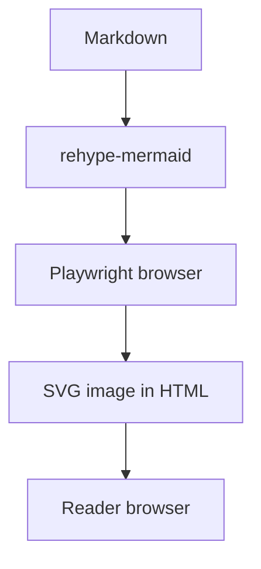

A technical diagram should be readable alongside its explanation. Rendering it during the build lets the reader receive an image without loading Mermaid to transform source text. The tradeoff is running the renderer in the build environment.

The previous version reported 11.6 and 6.3 seconds for 32 diagrams. This article has no preserved logs and sufficient parameters to reproduce those results. They have been removed. What follows is the site’s current configuration and a measurement method.

## This site’s configuration

At this revision, artka.dev uses Astro 7, `@astrojs/markdown-remark` and `rehype-mermaid`. The complete setup is in [astro.config.ts](https://github.com/node-develop/astro-blog/blob/main/astro.config.ts). This shortened fragment shows the relevant pipeline:

```typescript
import { defineConfig } from "astro/config";
import { unified } from "@astrojs/markdown-remark";
import mdx from "@astrojs/mdx";
import rehypeMermaid from "rehype-mermaid";

export default defineConfig({
  integrations: [mdx()],
  markdown: {
    processor: unified({
      rehypePlugins: [[rehypeMermaid, { strategy: "img-svg", dark: true }]],
    }),
  },
});
```

Astro 7 changed its default Markdown processor. The [migration guide](https://docs.astro.build/en/guides/upgrade-to/v7/) explains keeping the unified pipeline for remark and rehype plugins. MDX inherits the Markdown configuration in this repository.

The full production configuration also handles internal links, headings, images and LaTeX. Do not replace it wholesale with this excerpt.

## Inspect the output



After building, find this diagram’s SVG image in a data URI in the article HTML under `dist/client/`. Then inspect the deployed page with JavaScript disabled. The diagram should remain available. That does not mean the whole site ships no JavaScript: search, theme controls and other components can have scripts.

Check narrow screens and both themes. Tiny labels, cropped arrows and horizontal overflow are reading problems even when the build succeeds. Repeat the meaning briefly in surrounding prose: Markdown is processed at build time and the reader receives SVG.

## Measure the build cost

Record the commit, Node and dependency versions, machine and Mermaid block count. Compare the same pages in two temporary working copies: one rendering diagrams, the other using equivalent pre-generated SVGs. Both should publish the same material.

Separate dependency and browser installation, the first build in a new environment, repeated builds, and total CI time including image and artifact transfer.

Use `/usr/bin/time -p pnpm build` for this repository, saving stdout and stderr. Run each variant several times and report every observation, the median and spread. One cold and one warm run cannot attribute their entire difference to Mermaid because other caches also change.

Install the browser and system dependencies before the CI build. Match the browser installation to the Playwright version in the lockfile. Preserve rendering errors and diagram source instead of silently publishing an empty block.

## When the CLI fits better

The previous text incorrectly claimed that the CLI requires a separate process per diagram and cannot process Markdown. [mermaid-cli](https://github.com/mermaid-js/mermaid-cli) can replace Mermaid blocks in a Markdown input with generated SVG references:

```bash
mmdc -i readme.template.md -o readme.md
```

The CLI is useful when explicit image artifacts or shared diagrams suit the publishing workflow. Rehype fits diagrams maintained next to their paragraphs. Choose the content workflow first, then compare performance on your own corpus.

For metadata checks on the generated HTML, see [JSON-LD in Astro](/en/blog/json-ld-graph-astro/).
