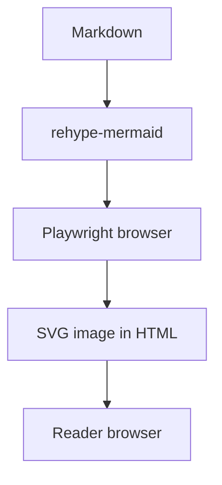

To make a Mermaid diagram readable without JavaScript, you can turn it into SVG during the site build. On artka.dev, `rehype-mermaid` does this: it renders through Playwright and inserts the finished image into HTML. The reader’s browser no longer needs Mermaid; the rendering browser and its system dependencies are needed in the build environment.

This example targets this repository’s Astro 7 configuration. Measure rendering costs on your own content: there are no reproducible measurements here to support a promise of a particular build time.

Imagine documentation for a service: the author explains a request’s path from the API to a queue and keeps a Mermaid block with the same transitions alongside it. When the architecture changes, it is convenient to update the paragraph and diagram in one pull request. But the text source still needs to become an image. If this happens on the client, the diagram’s readiness depends on loading and running its renderer. For a static article, you want a page whose explanation is already complete.

Build-time rendering solves this particular problem. The developer continues editing the diagram as text and checks the result before deployment. The work does not disappear: it moves into local builds and CI. A browser dependency appears there, and an error in one diagram can stop page generation. Assess the choice from both sides: what the reader receives and what the site owner now needs to maintain.

For the documentation example, a useful outcome is concrete: the diagram is included in the finished HTML, is readable on a phone, retains contrast in the selected theme, and does not require Mermaid to run for the visitor. Below is the path from configuration to these checks, followed by a way to determine whether the cost of this approach works for you.

## How to connect Mermaid to Markdown in Astro 7

In Astro 7, Sätteri processes Markdown by default. For existing remark/rehype plugins, you can keep `unified()` from `@astrojs/markdown-remark`, as described in the [Astro migration guide](https://docs.astro.build/en/guides/upgrade-to/v7/#new-default-markdown-processor-sätteri). This repository takes that approach.

Connect the plugin to the Markdown processor in `astro.config.ts`. A shortened example:

```typescript
import { defineConfig } from "astro/config";
import { unified } from "@astrojs/markdown-remark";
import mdx from "@astrojs/mdx";
import rehypeMermaid from "rehype-mermaid";

export default defineConfig({
  integrations: [mdx()],
  markdown: {
    processor: unified({
      rehypePlugins: [[rehypeMermaid, { strategy: "img-svg", dark: true }]],
    }),
  },
});
```

In the site configuration, `mdx()` inherits the Markdown processor. The dependencies are already declared in `package.json`; `pnpm-lock.yaml` pins their versions. If you transfer the example to another project, first check its Astro version and whether it has `@astrojs/markdown-remark`, `@astrojs/mdx`, and `rehype-mermaid`.

The `img-svg` strategy creates an `` element with SVG in a data URI: the image content lives directly in the HTML. This differs from `inline-svg`, which inserts the `<svg>` element itself. The `dark: true` option adds a dark-theme variant through `<picture>`. These modes are described in the [rehype-mermaid documentation](https://github.com/remcohaszing/rehype-mermaid#usage).

The full [astro.config.ts](https://github.com/node-develop/astro-blog/blob/main/astro.config.ts) also processes links, headings, images, and formulas. The excerpt explains how to connect Mermaid; when adapting it, add it to your configuration while preserving the other plugins.

## Choosing img-svg, inline SVG, or a separate file

All three options can display the same picture, but delivery and subsequent maintenance differ. With `img-svg`, the SVG is encoded in the image URL. The author does not need to host a separate file and maintain a link to it: the result travels with the page. The tradeoff is that the diagram data contributes to the HTML size. If a large diagram appears on several pages, its data will also be repeated in those documents.

With `inline-svg`, the diagram markup becomes elements of the HTML document itself. Choose this deliberately when you need that result, then check styling and accessibility within the site. Simply switching strategies does not preserve every property of the previous mode: for example, the `dark` option in `rehype-mermaid` supports images but not `inline-svg`. Such a switch requires separate consideration of theme handling.

A separate SVG file has its own path and can be referenced from several pieces of content. This works well for a shared architecture diagram used in documentation, a README, and an article. But you will need to agree on where the source lives and when to update the output. If you edit Mermaid but forget to regenerate the SVG, the published picture will remain unchanged. This becomes part of the content publishing process and should be made explicit.

Do not choose a format based solely on assumptions about search. [Google supports SVG in `img` and images in data URIs](https://developers.google.com/search/docs/appearance/google-images#use-supported-image-formats), but warns that embedding increases page size. This is a reason to check the result, not a guarantee of indexing. For an article, it is more important to keep a clear explanation beside the diagram and choose a format the team can maintain consistently.

## How to prepare Playwright for local builds and CI

Installing the Playwright package does not necessarily make the required browser available. The [Playwright documentation](https://playwright.dev/docs/browsers) associates each package version with specific browser binary versions. After updating the dependency, you may need to install the browser again.

In [this site’s Dockerfile](https://github.com/node-develop/astro-blog/blob/main/Dockerfile), the order is:

```bash
pnpm install --frozen-lockfile
pnpm exec playwright install --with-deps chromium-headless-shell
pnpm build
```

This is an abbreviated sequence from the Linux build environment based on `node:24-bookworm-slim`. The first command installs dependencies from the lockfile, the second installs the headless browser and its system dependencies, and the third builds the site. In the Dockerfile, the browser is installed in the `builder` stage.

If the browser does not start, check the installation in the same environment and under the same user that runs the build. If an error occurs for a particular Mermaid block, preserve the diagram text and the full error output. Replacing a failed render with an empty block conceals lost content.

Separating stages also helps investigate errors. If browser installation failed, it is too early to fix diagram syntax: the renderer does not yet have a working environment. If installation succeeded and a minimal diagram builds, you can move on to the contents of the problematic block. Preserving logs for these two stages helps keep the causes separate.

For a small blog, the additional dependencies may be an acceptable cost for editing diagrams alongside text. For a project with frequent builds and many diagrams, assess that cost separately. Client-side rendering leaves this work to the reader’s browser; build-time rendering assigns it to the project’s infrastructure; pre-generated files move it to a separate preparation step. Comparing builds will show which option is faster in your project.

## How to check SVG, themes, and diagram accessibility

Start with a small diagram:



The first three transitions happen during the build. The reader receives HTML with SVG in a data URI and sees a diagram that is already prepared.

After the build, check the result in order:

1. Find the article HTML in `dist/client/`. This diagram should produce an `` with SVG in a data URI; with `dark: true`, also check the `<picture>` wrapper.
2. Open the built page with JavaScript disabled. The diagram should remain visible. Search, the theme switcher, and other site components may use their own scripts: this check concerns the diagram’s content.
3. Check the light and dark system themes. Then enable JavaScript and check the site’s own theme switcher. In `rehype-mermaid` 3.0.0, image selection in `<picture>` depends on `prefers-color-scheme`. On its own, `dark: true` does not connect the image to an arbitrary site switcher.
4. Reduce the window to a mobile width. Make sure labels are readable, arrows are not cropped, and horizontal scrolling is available if needed.

A successful build confirms that the renderer processed the diagram. Readability needs a visual check. Repeat the diagram’s meaning in the adjacent paragraph: the content should be understandable without examining the image.

For a request-processing diagram, check both the arrows’ integrity and the explanation’s accuracy: do labels match the names in the text, is the direction of data transfer clear, and can readers distinguish the success and error branches? A technically valid SVG can depict an outdated architecture. Checking it alongside the paragraph helps catch such a mismatch before publication.

Check the image’s text alternative separately. In the local plugin version, `alt` comes from the rendered result’s description; without a description, it becomes an empty string. The presence of an image therefore does not prove that its meaning is accessible without sight. In the example above, `accTitle` supplies an accessible diagram title, and `accDescr` describes its meaning. Add these lines after the diagram type declaration and replace the text with your own: the title should help identify the diagram, and the description should explain the process shown. These fields are covered in the [official Mermaid accessibility syntax](https://mermaid.js.org/config/accessibility.html). Then check the final `alt` in the HTML: transferring the description from SVG to the image depends on the plugin used. For a complex diagram, the adjacent paragraph should explain essential relationships that a short `alt` cannot hold. [Google’s image recommendations](https://developers.google.com/search/docs/appearance/google-images#descriptive-filenames) connect descriptions and surrounding text with image understanding and accessibility; there is no need to list search queries in `alt`.

## What to do if Mermaid is missing or looks wrong

If the page still shows a source code block, start with its language: the fenced block must specify `mermaid`. Then check that the page is processed by the configuration containing the plugin. For MDX, look for a separate override of Markdown settings. Inheritance is enabled in this repository, but another project may work differently. Changing several settings at once makes diagnosis harder: after each edit, build one minimal diagram and inspect the HTML.

If the error says the browser executable is missing, repeat the project’s browser installation step after installing dependencies. Check that the build runs in the same environment: a browser installed on your laptop does not automatically appear in a container. If system libraries are reported missing, check the step with `--with-deps` and its log. After updating Playwright, compare versions with the lockfile before reusing an old environment.

If one diagram fails, temporarily reduce it to a few nodes, keeping the original version separately. Restore branches in parts until you find the fragment that causes the error. This minimal example is useful both for fixing it yourself and for reporting a plugin bug. Do not hide the problem behind an empty result: the reader may not notice that an essential part of the explanation has disappeared.

If the SVG exists but labels are unreadable on a phone, revise the diagram itself: shorten node text, separate independent processes, and move details into a paragraph. If colors conflict with the page theme, compare the system theme and the site switcher separately. Decide which mechanism should control the image, align it with the page theme, and check both states again.

## How to measure Mermaid’s build cost

The previous version of this article cited 11.6 and 6.3 seconds for 32 diagrams. There are no preserved logs or sufficient descriptions of the conditions, so these numbers cannot serve as a reference.

For your project, prepare two temporary copies of the same commit. Keep Mermaid blocks and build-time rendering in the first; replace them with pre-generated static SVGs in the second. The pages, diagram content, and remaining settings must match. This experiment measures the cost of the chosen publishing method on your own collection of content.

Before running it, record the commit, Node, pnpm, and dependency versions, machine specifications, Mermaid block count, and `dark` setting. Account separately for:

- installing packages, the browser, and system dependencies;
- the first build in a new environment;
- repeated builds in the same environment;
- total CI time, including image and artifact transfer.

For a single run on macOS or Linux:

```bash
/usr/bin/time -p pnpm build > build.stdout.log 2> build.stderr.log
```

The `build.stderr.log` file contains build stderr and the timing lines `real`, `user`, and `sys`. Compare `real`: it measures the time from command start to completion. Save separate logs for each run and count only builds that finish successfully.

In this repository, `pnpm build` runs `astro build --force`, then rebuilds the Pagefind index. The measured time covers the entire command, including search indexing. It cannot be called Mermaid-only time; using the same command for both variants allows you to compare the overall build cost.

Run each variant several times under the same conditions and preserve all results, the median, and the spread. One cold run and one warm run change several factors at once: their entire difference cannot be attributed to diagrams.

## When mermaid-cli is more convenient

If you need diagrams as separate SVG files, for example for several documents, consider [mermaid-cli](https://github.com/mermaid-js/mermaid-cli#transform-a-markdown-file-with-mermaid-diagrams). It can read Markdown, create SVGs from Mermaid blocks, and replace those blocks with image links:

```bash
mmdc -i readme.template.md -o readme.md
```

This command assumes that `mmdc` is already installed and available. The CLI is not declared in this repository’s dependencies.

The earlier claim that the CLI does not process Markdown and necessarily requires a separate run for each diagram was incorrect. A single Markdown input can contain several diagrams.

Rehype is convenient when a diagram is edited alongside a paragraph and should be built with the page. The CLI is convenient when the output needs to be separate files. Check the performance of both options on your own diagrams under the same conditions.

After checking the images, move on to the finished page’s metadata: [how to check JSON-LD in Astro](/en/blog/json-ld-graph-astro/).
