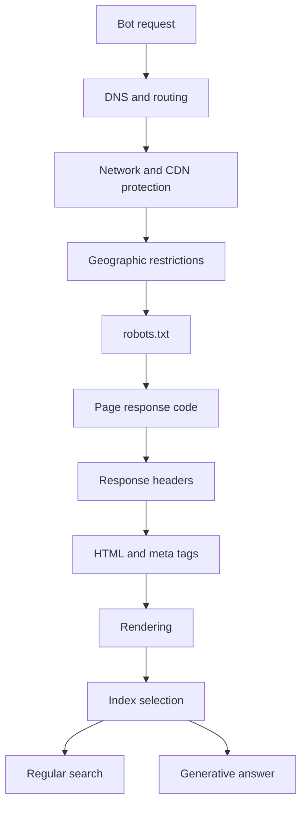

> Allowing GPTBot doesn't control your ChatGPT visibility. Google-Extended doesn't control your presence in AI Overviews. And your CDN can shut bots out without robots.txt ever showing it. Over the summer of 2026, the question of "let the bot in or not" gained a fourth lever and an entire layer of network-level control. Here's what controls what as of September 2026, based on the bot owners' own documentation, not on someone else's roundup.

---

## 1. Four tasks, not three

The previous version of this article split things into three tasks. Now there are four: Google split regular search and generative search answers into separate levers.

| Task                                  | What controls it                                                |
| ------------------------------------- | --------------------------------------------------------------- |
| Appearing in regular Google Search    | Googlebot in robots.txt, HTTP status, noindex, canonical        |
| Appearing in AI Overviews and AI Mode | The Search generative AI control in Search Console, nosnippet   |
| Use for model training                | Rules for the training bot (GPTBot, ClaudeBot, Google-Extended) |
| Fetching a page on user request       | Almost nothing: these bots often don't honor robots.txt         |

The Search generative AI control rolled out to every site worldwide on August 31, 2026. It covers AI Overviews, AI Mode, and generative features in Discover, takes three values (include, exclude, inherit from the parent resource), and takes effect within a few days. Google spells out the boundary separately: "This control only affects whether your content can appear in certain Search generative AI features; this control isn't used as a ranking or inclusion signal affecting other parts of Search."

For individual chunks of a page, there's a more precise lever. The `nosnippet` directive and the `data-nosnippet` attribute are now described as forbidding a text from being used "as a direct input for AI Overviews and AI Mode."

The fourth row in the table is the least pleasant one, because there's almost no lever there at all. OpenAI writes about ChatGPT-User: "Because these actions are initiated by a user, robots.txt rules may not apply." Meta writes about Meta-ExternalFetcher: "may bypass robots.txt because it performs fetches that were requested by the user." Perplexity writes about Perplexity-User: "generally ignores robots.txt rules." This isn't a violation on their part — it's declared behavior.

---

## 2. Who's who as of September 2026

This table is built solely from the bot owners' own documentation. Names from third-party roundups didn't make the cut.

| Owner      | Training             | Search and indexing | User request            | Other            |
| ---------- | -------------------- | ------------------- | ----------------------- | ---------------- |
| OpenAI     | GPTBot               | OAI-SearchBot       | ChatGPT-User            | OAI-AdsBot       |
| Anthropic  | ClaudeBot            | Claude-SearchBot    | Claude-User             |                  |
| Google     | Google-Extended      | Googlebot           | Google-Agent and others | AdsBot, Storebot |
| Perplexity | not used             | PerplexityBot       | Perplexity-User         |                  |
| Amazon     | Amazonbot            | Amzn-SearchBot      | Amzn-User               |                  |
| Mistral    | MistralAI-Training   | MistralAI-Index     | MistralAI-User          |                  |
| Meta       | Meta-ExternalAgent   | Meta-WebIndexer     | Meta-ExternalFetcher    | Meta-ExternalAds |
| Apple      | Applebot (mixed use) | Applebot            |                         | iTMS             |
| Microsoft  | no dedicated token   | Bingbot             |                         |                  |

What matters in this table isn't the names, it's the separation. OpenAI, Anthropic, Amazon, Mistral, Meta, and Perplexity split their tasks across different bots, so opting out of training doesn't touch search. At Apple, Google, and Microsoft, one bot does both, so there's no separate lever and you have to rely on add-ons instead.

Apple states this outright: "The data crawled by Applebot may also be used to help train Apple foundation models powering generative AI features." That's exactly why they have Applebot-Extended: it doesn't affect search presence, only blocks use for training.

Microsoft has no dedicated training token at all — control runs through meta tags: `NOARCHIVE` means the content won't end up in Bing Chat answers or in training, `NOCACHE` allows it to be shown as an answer with a URL, title, and snippet.

Four notes that deserve their own mention.

**Google-Extended moved** from the special-cases page to the common crawlers page and got a precise definition: "training future generations of Gemini models," and "does not impact a site's inclusion in Google Search nor is it used as a ranking signal in Google Search."

**OAI-AdsBot is a recent addition**, and robots.txt doesn't apply to it. OpenAI tells advertisers directly: "You must allow OAI-AdsBot."

**Cohere has no active crawlers.** Verbatim: "We do not use Cohere bots or user agents for the purpose of crawling or scraping web content to train generative AI foundation models at this time." If one appears, the token will be `Coherebot`. A `cohere-ai` group in anyone's file today means nothing.

**Bytespider has no primary source.** Neither ByteDance's nor TikTok's site has a page describing the crawler. The name only circulates in third-party directories. If it's in your file, you have no way to verify it's correct.

---

## 3. What the network decides while you're editing the file

This is a layer the previous version of this article didn't have at all, and over 2025 and 2026 it became decisive.

In September 2025, Cloudflare announced the Content Signals Policy: three signals right in robots.txt, with yes-or-no values.

```text
User-Agent: *
Content-Signal: search=yes, ai-train=no
Disallow: /admin/
```

For customers on managed robots.txt — 3.8 million domains — the values `search=yes, ai-train=no` were set centrally. A third signal, `use`, was added later, with the values `immediate` (no storage), `reference` (indexing with a link), and `full` (summarization and reproduction).

As of July 1, 2026, the single "block AI bots" switch was replaced by three categories: Search, Agent, Training. Available on every plan, including the free one.

Here's what matters most for a site owner. **As of September 15, 2026, the defaults changed for new domains**: bots in the Training and Agent categories are blocked on pages with ads, while Search stays allowed. Existing customers keep their current settings, but the old "Block AI bots" option is now marked as deprecated.

The practical takeaway: a site can be wide open in robots.txt and still be closed at the network level. There's no way to see that from the file itself.

Bot Preference Sync arrived in August 2026: category settings get written into robots.txt, appending rules on top of what's already there. It's on by default for new customers. In other words, your file can change without your hands touching it.

There's also a separate "Disallow AI Training" setting for mixed-use crawlers, introduced on September 15, 2026. It solves exactly the problem from section two: at Apple, Google, and Microsoft, one bot handles both search and training, so blocking training used to knock a site out of search too. Cloudflare set up "Accountable" criteria — four of them: honoring a training opt-out via robots.txt, honoring an opt-out from AI summaries, visibility at the address level, and a guarantee that opting out of training won't affect regular search.

There's a documented case of not everyone honoring the rules. In August 2025, Cloudflare caught Perplexity running undeclared crawlers with an ordinary browser user-agent string and addresses outside the official list, rotating across different autonomous systems, and removed the company from its verified bots registry. The declared Perplexity-User accounted for 20 to 25 million requests a day; the hidden one, 3 to 6 million. Common Crawl, for its part, separately warns about impersonators posing as CCBot.

A conclusion worth saying outright: robots.txt is a request, not a lock. Protected content needs authentication.

---

## 4. Where the standard is headed

robots.txt itself was standardized in 2022 as RFC 9309, and it's not a draft — it's on the Internet Standards Track. Three things worth knowing from it: caching no longer than 24 hours, a parsing limit of at least 500 kilobytes, and on a 5xx response a crawler "MUST assume complete disallow."

Everything past that is drafts, and they're worth telling apart.

The IETF aipref working group is drafting two main documents. The first, `draft-ietf-aipref-vocab`, introduces three categories: `train-ai` (changing a model's trainable parameters), `ai-use` (feeding material into a model as input when a user didn't supply it), and `search`. Values are `y` and `n`, plus a third "unknown" state, with a strictest-wins rule: if even one source disallows, it's disallowed. The second, `draft-ietf-aipref-attach`, introduces a `Content-Usage` response header and a matching robots.txt rule that can be tied to a path:

```text
Content-Usage: train-ai=n
```

The authors include Gary Illyes from Google and Martin Thomson from Mozilla. But these are drafts, and the spec itself notes that expressing a preference doesn't guarantee it will be honored. No bot owner has publicly stated that they read `Content-Usage` or `Content-Signal`.

There's a separate line that's already working: request signing. Since May 2026, Google has a Web Bot Auth guide, and part of Google-Agent's traffic is cryptographically signed per RFC 9421. The response carries `Signature-Agent`, `Signature`, and `Signature-Input` headers, with keys published at a fixed address. Google is honest about the limits: "Not all Google user agents are using Web Bot Auth" and "Google is not yet signing every request of agents using the protocol." A curious detail on top of that: the signing protocol itself is an individual draft with no IETF working group behind it — not a standard.

For practice, this changes one thing: spoofing the User-Agent string with curl didn't prove anything before, and now it's falling even further behind what's actually happening.

---

## 5. Why you can't hide noindex behind Disallow

This remains the most common mistake, and the mechanics are simple. To read a `noindex` directive in the HTML, a bot has to fetch the page. If crawling is disallowed in robots.txt, the directive stays unread. Google states this directly: "For the noindex rule to be effective, the page or resource must not be blocked by a robots.txt file."

That's why internal site search stays open for crawling and gets excluded through `noindex` instead. These are two different decisions with different purposes, and they aren't interchangeable.

It's worth knowing how response codes get read in two different contexts.

| Code | On robots.txt itself                                        | On a regular page                       |
| ---- | ----------------------------------------------------------- | --------------------------------------- |
| 2xx  | rules apply                                                 | normal handling                         |
| 4xx  | treated as if the file doesn't exist, crawling is wide open | the URL gets removed from the index     |
| 429  | treated the same as a server error                          | a sign of overload, crawling slows down |
| 5xx  | no crawling for 12 hours, then 30 days on the old copy      | crawl rate drops, URLs drop out later   |

Two traps here deserve a separate mention. A 5xx error on the service file halts crawling of the entire site for half a day. And a 4xx error on it doesn't mean "closed," it means "wide open": you can't count on a bot being cautious when robots.txt is unavailable.

Another trap involves named groups. Exactly one group applies — the one with the most specific name match — and groups don't merge with the `*` group. If you set up a separate group for GPTBot and wrote only `Allow: /` in it, `Disallow: /admin/` from the wildcard group no longer applies to it. Keep this in mind every time you add a name.

The flip side of the same rule can be useful. On artka.dev, the `Disallow: /*.md$` rule deliberately lives only in the wildcard group: it blocks markdown copies of articles for regular search bots without touching the AI-agent groups listed above, for whom those copies are actually convenient.

---

## 6. When the bot still doesn't get through

Permission in robots.txt is one point on a long path. It can be refused at any other point.



Here's the check order, from most to least frequent based on what I've actually run into and what's confirmed by documentation:

1. **CDN defaults.** Since September 15, 2026, new Cloudflare domains block the Training and Agent categories on pages with ads. None of this shows up in robots.txt.
2. **A 403 from bot protection.** For Google this is just a regular 4xx error, and indexed URLs get removed from the index. A typical source: a proxy rule triggering on an unfamiliar User-Agent string.
3. **Geographic restrictions.** Googlebot crawls from addresses both inside and outside the US. If the server behaves differently by region, robots.txt and meta tags "must specify the same rules in each locale."
4. **A 5xx error on robots.txt.** Half a day of silence, then a month on the old copy.
5. **A named group that overrode the wildcard one.** See the previous section.

How to actually check this. A regular GET, not HEAD:

```bash
curl -sS -D /tmp/headers.txt https://artka.dev/blog/ -o /tmp/page.html
```

In the headers, check the status and the absence of an unwanted `X-Robots-Tag`; in the HTML, check for its own canonical and the absence of an unwanted meta robots tag. If there's a redirect, check the final destination too: a first 301 can still lead to a 404.

Here are three ways to confirm you're looking at a real bot, not an impersonator:

| Owner        | Reverse DNS | IP-list file               | Request signature |
| ------------ | ----------- | -------------------------- | ----------------- |
| Google       | yes         | yes, several files by type | partial           |
| Anthropic    | no          | yes, one combined file     | no                |
| OpenAI       | no          | yes, one file per bot      | no                |
| Common Crawl | yes         | yes                        | no                |

For Google, the allowed domains for reverse verification are `googlebot.com`, `google.com`, and `googleusercontent.com`, and you need to check both directions. Anthropic's reverse DNS doesn't work at all: I opened their IP-list file, and it has 26 IPv4 prefixes belonging to Google Cloud, Azure, and AWS, with no bot names in the file. All you can do is check against the list.

A separate tool showed up in June 2026: generative-AI reports in Search Console, rolled out to every site by August 31. An important limitation: it's impressions only. No clicks, and queries aren't a dimension there.

---

## 7. llms.txt: what we know as of September 2026

The format is alive: version 2 of the spec shipped in August 2026, adding discovery via `rel="alternate" type="text/markdown"` and `rel="describedby"`, allowing both ways of addressing markdown copies, and formally describing path-based inheritance.

On Google, the picture is completely clear, and it's negative. From the generative-search-features guide: "You don't need to create new machine readable files, AI text files, markup, or Markdown to appear in Google Search," and specifically about llms.txt: "Doing so will neither harm nor help your site's visibility or rankings in Google Search, as Google Search ignores them." In January 2026, John Mueller answered a question about whether the presence of such a file on Google's own sites meant an endorsement of the format: "I'm tempted to say something snarky since this has come up so often, but to be direct, no."

Chrome added an experimental Lighthouse category called Agentic Browsing, and it includes an llms.txt audit. A detail that usually gets retold wrong: if the file is missing, the audit is marked not applicable, not failed. A failure only happens on a server error. In other words, Lighthouse neither rewards having the file nor punishes not having it.

OpenAI, Anthropic, and Google all publish llms.txt for their own developer documentation. That doesn't mean their crawlers read anyone else's: none of them has made an official statement about consuming the format.

The takeaway for a site owner: as a directory of material for agents that know how to read it, the file is useful. As a lever for search visibility, it doesn't work, and there's no point expecting growth from it.

---

## 8. What to do with your own file

A short procedure that follows from everything above.

First, decide which of the four tasks actually matter to you. For a personal technical blog, the usual answer is: search visibility matters, generative-answer visibility matters, model training is acceptable, and fetching on user request isn't controllable anyway.

Then write the file around that decision, not around a list of names. A basic policy fits in six lines:

```text
User-agent: *
Allow: /
Disallow: /admin/
Disallow: /api/

Sitemap: https://artka.dev/sitemap-index.xml
```

Add named groups only when the policy for that bot actually differs from the general one. Every such group has to be complete: restrictions from `*` aren't inherited into it.

Check names against the owner's documentation. Bot roundups in other people's blogs go stale faster than they get updated: until today, my own file still had a `cohere-ai` group that doesn't exist in Cohere's documentation.

And check the layer that's invisible in the file: CDN settings, bot-protection behavior, response codes on robots.txt itself. An open file behind a closed network looks exactly the same as an open file behind an open one.

This site's current policy lives in [robots.txt](/robots.txt), and the content directory for agents is in [llms.txt](/llms.txt).

---

## Takeaway

Over the summer of 2026, access control stopped fitting into a single file. Google got a separate lever for generative answers, CDNs got bot categories with defaults that change without your involvement, and the IETF is writing a preference vocabulary that nobody is obligated to honor yet. Meanwhile, bot owners have gone their separate ways: half of them split tasks across different names, the other half have one bot doing everything at once.

The practical takeaway hasn't changed, but it's gotten sharper. The list of allowed names in robots.txt isn't your access policy — it's a small part of it. The policy starts with answering which of the four tasks you actually need, and ends with verifying that a bot actually gets the page. Between those two points, the robots.txt file accounts for roughly a third of the path. If a page is already crawled, you've cleared every lever in this article, and the next question is [something else entirely](/en/blog/crawled-not-indexed-astro-audit/).

---

**Sources:**

- [OpenAI: bots](https://developers.openai.com/api/docs/bots) — GPTBot, OAI-SearchBot, ChatGPT-User, OAI-AdsBot
- [Anthropic: web crawling](https://support.claude.com/en/articles/8896518-does-anthropic-crawl-data-from-the-web-and-how-can-site-owners-block-the-crawler) — ClaudeBot, Claude-SearchBot, Claude-User
- [Google: common crawlers](https://developers.google.com/crawling/docs/crawlers-fetchers/google-common-crawlers) — the wording on Google-Extended
- [Google: Search generative AI control](https://support.google.com/webmasters/answer/16908024) — rollout to every site on August 31, 2026
- [Google: robots meta tags](https://developers.google.com/search/docs/crawling-indexing/robots-meta-tag) — nosnippet as input for AI Overviews
- [Google: robots.txt specification](https://developers.google.com/crawling/docs/robots-txt/robots-txt-spec) — response codes, the 500-kilobyte limit, single group
- [Google: blocking indexing](https://developers.google.com/search/docs/crawling-indexing/block-indexing) — why you can't hide noindex behind Disallow
- [Google: verifying requests](https://developers.google.com/crawling/docs/crawlers-fetchers/verify-google-requests) — reverse DNS and IP lists
- [Google: Web Bot Auth](https://developers.google.com/crawling/docs/crawlers-fetchers/web-bot-auth) — request signing, its limits
- [Google: generative features guide](https://developers.google.com/search/docs/fundamentals/ai-optimization-guide) — on llms.txt and machine-readable files
- [Apple: Applebot](https://support.apple.com/en-us/119829) — mixed use and Applebot-Extended
- [Amazon: Amazonbot](https://developer.amazon.com/amazonbot) — Amzn-SearchBot and Amzn-User
- [Mistral: bots](https://docs.mistral.ai/robots) — the split into three tasks
- [Meta: crawlers](https://developers.facebook.com/documentation/sharing/webmasters/web-crawlers) — Meta-WebIndexer and Meta-ExternalAds
- [Perplexity: bots](https://docs.perplexity.ai/guides/bots) — PerplexityBot and Perplexity-User
- [Cohere: crawlers](https://docs.cohere.com/docs/cohere-web-crawlers) — no active crawlers
- [Cloudflare: Content Signals Policy](https://blog.cloudflare.com/content-signals-policy/) — three signals in robots.txt
- [Cloudflare: bot categories](https://developers.cloudflare.com/bots/additional-configurations/block-ai-bots/) — defaults as of September 15, 2026
- [Cloudflare: mixed-use crawlers](https://blog.cloudflare.com/accountable-mixed-use-ai-crawlers/) — the Accountable criteria
- [Cloudflare: Perplexity's stealth crawlers](https://blog.cloudflare.com/perplexity-is-using-stealth-undeclared-crawlers-to-evade-website-no-crawl-directives/) — the August 2025 case
- [RFC 9309](https://www.rfc-editor.org/rfc/rfc9309.html) — the robots.txt standard
- [IETF aipref](https://datatracker.ietf.org/wg/aipref/documents/) — drafts of the preference vocabulary and the Content-Usage header
- [llmstxt.org](https://llmstxt.org/) — the spec, version 2 from August 2026
- [Chrome Lighthouse: Agentic Browsing](https://developer.chrome.com/docs/lighthouse/agentic-browsing/llms-txt) — how llms.txt gets scored
