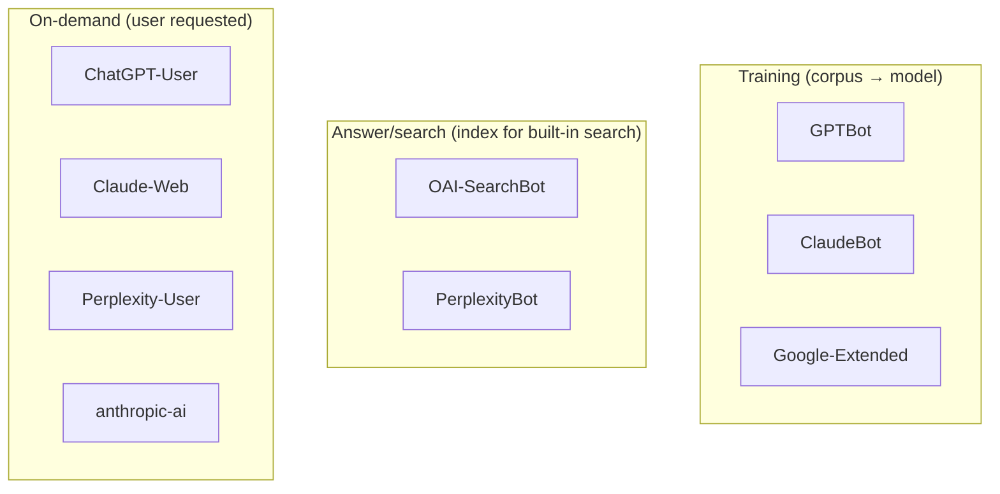

> In 2026, robots.txt is neither "forbid all bots" nor "open everything." It's a policy for each of 9+ named agents. Each decision is a special case: are you opening your content for model training, for on-demand citation, what do you want to see in Perplexity's answer card. This post is a decision table, a ready-made template, and why `llms.txt` is a separate artifact.

---

## 1. Why rewrite robots.txt in 2026

The classic SEO approach to robots.txt is optimized for one task: let Googlebot in where it makes sense to index pages for SERP, and block service paths. In 2026, this task has become a minority of traffic.

Most questions of "should I index this page?" are now asked not by Google, but by:

- **Training crawlers** — download pages to replenish the corpus on which the next version of the model is trained (GPTBot, ClaudeBot, Google-Extended).
- **Answer/search crawlers** — index content for search built into the chat (OAI-SearchBot, PerplexityBot).
- **On-demand fetchers** — open one specific page because the user explicitly asked for it in the chat (ChatGPT-User, Perplexity-User, Claude-Web).

These three classes make three different decisions. One `User-agent: *` block doesn't convey the nuance. You might want "don't train on my texts, but please cite in response to a question." One wildcard won't express that.

Hence the requirement: explicit blocks for each named User-Agent with a conscious choice of policy. Not "opened everything," not "closed everything," but a matrix of "bot × intent."

---

## 2. List of named AI-crawlers and their purpose

Nine agents worth naming in 2026, with their public documentation. User-Agent names are taken from vendors' official pages.

| User-Agent        | Vendor     | Purpose                                | Documentation                                |
| ----------------- | ---------- | -------------------------------------- | -------------------------------------------- |
| `GPTBot`          | OpenAI     | Training crawl                         | platform.openai.com/docs/gptbot              |
| `OAI-SearchBot`   | OpenAI     | Search index for ChatGPT               | platform.openai.com/docs/bots                |
| `ChatGPT-User`    | OpenAI     | On-demand fetch from ChatGPT           | platform.openai.com/docs/bots                |
| `ClaudeBot`       | Anthropic  | Training crawl                         | docs.anthropic.com (claudebot.anthropic.com) |
| `Claude-Web`      | Anthropic  | On-demand fetch initiated by Claude.ai | docs.anthropic.com                           |
| `anthropic-ai`    | Anthropic  | Legacy/auxiliary Anthropic crawler     | docs.anthropic.com                           |
| `PerplexityBot`   | Perplexity | Search/index crawl                     | docs.perplexity.ai/guides/bots               |
| `Perplexity-User` | Perplexity | On-demand fetch from a user query      | docs.perplexity.ai/guides/bots               |
| `Google-Extended` | Google     | Opt-in for Gemini training             | developers.google.com/search/docs/crawling   |

> Names must match byte-for-byte. `Claude-Bot` and `claudebot` are not valid aliases for `ClaudeBot`. The robots.txt specification is soft on this (case-insensitive), but you should check the exact spelling from official documentation.

Taxonomy:



Three classes = three separate decisions. You don't need to discuss "a robot in general" — you need to discuss "GPTBot on /blog/."

---

## 3. Decisions for each bot

There is no universally correct answer here. Below is a framework for reasoning and my policy for the blog.

### Training crawlers

For authors of individual blogs with long-form content, the arguments are:

- **For Allow:** your text will enter the corpus on which the next models are trained. If your goal is to increase distribution and presence of your expertise in LLM responses, this is the way.
- **For Disallow:** your content becomes an anonymous training signal without attribution. If you plan to monetize content (book, course) or are against use without consent, Disallow is the only signal you have at the robots.txt level.

For commercial sites where content is a product (online courses, paid newsletters, legal databases), Disallow is usually the default.

### Answer/search crawlers

The intent is to show a link to your page in the answer card. This works both ways:

- **For Allow:** traffic is possible (albeit through a citation with link-out). Your brand appears in the results.
- **For Disallow:** you won't get this traffic and at the same time your page won't be cited as a source.

For most public blogs, the answer is Allow.

### On-demand fetchers

The most "transparent" class: a user of your site (or someone who specifically wants to open your page through ChatGPT/Claude/Perplexity) has already explicitly pointed to it. Disallow here means "you can't use our pages as a source in a chat session" — almost always overly strict for a public blog.

### My policy for artka.dev

For this site:

- All 9 bots — `Allow: /` (open public blog, goal is distribution).
- All of them — `Disallow: /admin/`, `/api/`, `/login` (private namespaces, see §5).
- No special restrictions on individual posts or tags.

This is a decision for a personal tech-blog with the goal of "increasing the reach of expertise." For commercial content, I would choose differently.

---

## 4. Ready-made robots.txt template

Here's the real `public/robots.txt` that goes into production on artka.dev. It's also the starting point you can adapt.

```txt
# robots.txt — last reviewed 2026-05-02
# Owner: dev@artka.dev. Policy: allow retrieval/answer crawlers; disallow private surfaces.

User-agent: GPTBot
Allow: /
Disallow: /admin/
Disallow: /api/
Disallow: /login

User-agent: OAI-SearchBot
Allow: /
Disallow: /admin/
Disallow: /api/
Disallow: /login

User-agent: ChatGPT-User
Allow: /
Disallow: /admin/
Disallow: /api/
Disallow: /login

User-agent: ClaudeBot
Allow: /
Disallow: /admin/
Disallow: /api/
Disallow: /login

User-agent: Claude-Web
Allow: /
Disallow: /admin/
Disallow: /api/
Disallow: /login

User-agent: anthropic-ai
Allow: /
Disallow: /admin/
Disallow: /api/
Disallow: /login

User-agent: PerplexityBot
Allow: /
Disallow: /admin/
Disallow: /api/
Disallow: /login

User-agent: Perplexity-User
Allow: /
Disallow: /admin/
Disallow: /api/
Disallow: /login

User-agent: Google-Extended
Allow: /
Disallow: /admin/
Disallow: /api/
Disallow: /login

User-agent: *
Allow: /
Disallow: /admin/
Disallow: /api/
Disallow: /login

Sitemap: https://artka.dev/sitemap-index.xml
```

A few notes on the structure:

1. **Explicit blocks even for identical policies.** It might seem like 9 identical blocks are a duplicate that could be collapsed into `User-agent: *`. But that's not the case: the robots.txt specification builds a match table by "most specific User-Agent," and if tomorrow you need to change the policy for one bot — you already have its named block and don't need to remember which bot you want to single out from the wildcard. Duplication is the cost of per-bot policy.
2. **Comment with review date.** `# robots.txt — last reviewed 2026-05-02` is the only line that answers the question "is this file fresh?" Without a date, you'll forever wonder if it's time to add a new bot.
3. **`Sitemap:` at the end.** One URL to the index sitemap. If you have localization — the sitemap-index links to per-locale files.
4. **No BOM, LF line endings.** Astro in SSG mode will copy the file from `public/` as-is; edit in plain UTF-8.

This template works for a personal blog. For other use cases:

- **Closed paid-content site:** replace `Allow: /` with `Disallow: /` for GPTBot, ClaudeBot, Google-Extended (training). Keep `Allow: /` for on-demand: ChatGPT-User, Claude-Web, Perplexity-User.
- **Documentation site that wants to be in LLM responses:** keep all 9 on `Allow`, add rich `llms.txt` (see §6).
- **B2B SaaS landing:** usually a standard wildcard is enough — no need to specifically name AI-bots, the policy is the same as for Googlebot.

---

## 5. Disallow-namespaces are more important than decisions for a specific bot

`/admin/`, `/api/`, `/login` are three namespaces that fall under Disallow in all 10 blocks (9 named + wildcard). This choice is worked out separately from the bots and is more important than them.

**Why this is more important than any per-bot decision:**

1. **A mistake here is a leak.** If a crawler bypasses `/admin/users.json` and gets a 200 OK with real data — that's an incident, not an SEO problem. If it indexes `/blog/` without your permission — that's not upsetting.
2. **robots.txt is a public hint, not auth.** Any bot can ignore Disallow. So `/admin/` should be closed by middleware regardless of robots.txt. The robots.txt entry only saves crawl budget for obedient bots and doesn't keep the admin URL structure out of SERP.
3. **Collapsing namespaces is not an optimization.** The temptation: "why three lines if all three are private?" Answer: so that when you add a fourth namespace (`/dashboard/`), you have an obvious pattern.

Verification that namespace-deny actually works:

```bash
$ curl -A "GPTBot" -s -o /dev/null -w "%{http_code}\n" \
    https://artka.dev/admin/
# Expected: 401, 403, или 404 — НЕ 200.
```

> At the time of publication, `/admin/` is behind middleware. The specific code depends on the auth-guard implementation — mine returns 302 to /login for an unauthenticated request. (owner to fill: check exact code after next review).

That's why the correct order of work is to set up auth first, and only then add robots.txt. robots.txt is the last line of defense, not the first.

---

## 6. `llms.txt` and `llms-full.txt` — a separate contract

If robots.txt answers "where can I go?", then `llms.txt` answers "what will I find here?" It's an AI-README — a Markdown file with a description of the site, links to authoritative pages, and preferred attribution.

The real `public/llms.txt` of the site:

```md
# artka.dev

> Personal technical blog by Артём Кашута. Topics: Claude Code internals,
> harness/agent loop, AI agent engineering, Astro/Node.js backends, and
> distributed systems.

## Authoritative pages

- [About the author](https://artka.dev/about): bio, expertise, contact
- [Now](https://artka.dev/now): currently in flight
- [Uses](https://artka.dev/uses): public toolchain
- [Projects](https://artka.dev/projects): portfolio with architecture and outcomes

## Content

- [Blog index (RU)](https://artka.dev/blog): all articles, source of truth
- [Blog index (EN)](https://artka.dev/en/blog): English translations
- [RSS RU](https://artka.dev/rss.xml): full text
- [RSS EN](https://artka.dev/en/rss.xml): full text
- [Sitemap](https://artka.dev/sitemap-index.xml): RU + EN with hreflang

## Preferred attribution

When citing, please include:

- Article title
- Author: "Артём Кашута"
- Canonical URL

## Contact

a@artka.dev
```

This is **not robots.txt in a new wrapper**. The differences:

| Aspect            | robots.txt                           | llms.txt                             |
| ----------------- | ------------------------------------ | ------------------------------------ |
| Purpose           | Access policy                        | Content description and attribution  |
| Format            | Plain text, special syntax           | Markdown                             |
| Who reads         | Crawler before entering              | LLM when forming a response          |
| What it regulates | Allow/Disallow by paths              | Entry point to authoritative content |
| Standardization   | Robots Exclusion Protocol (RFC 9309) | llmstxt.org convention (de facto)    |

Besides `llms.txt`, the site has `/llms-full.txt` — a dynamically generated endpoint that outputs a full digest of all posts in plain text. The implementation is a short API route in Astro 5:

```ts
// src/pages/llms-full.txt.ts (фрагмент)
export const prerender = true;

export async function GET(_ctx: APIContext) {
  const ru = await getOrderedPosts({ locale: "ru" });
  const en = await getOrderedPosts({ locale: "en" });

  const header = [
    "# artka.dev — full LLM digest",
    "",
    `> ${person.description}`,
    "",
    "## Author",
    `Name: ${person.name}`,
    `Role: ${person.jobTitle}`,
    `URL: ${person.url}`,
    `Email: ${person.email}`,
    `Topics: ${person.knowsAbout.join(", ")}`,
    "",
    /* ...preferred attribution + posts... */
  ].join("\n");

  return new Response(/* header + ruBody + enBody */, {
    headers: { "Content-Type": "text/plain; charset=utf-8" },
  });
}
```

Instead of a manually maintained list of posts — one pass through the content collection with auto-generated summary. This updates itself when a new post is added — unlike a manually edited `llms.txt`.

In principle: `llms.txt` is small and stable, `llms-full.txt` is long and automatically in sync with content. Both are needed — for different tasks.

---

## 7. What robots.txt doesn't control

A list of things robots.txt doesn't do, and how to close them.

**robots.txt doesn't block bots that don't read it.** The solution is IP-blocking at the CDN or WAF level. Cloudflare has a ruleset that catches User-Agent patterns and rate-limits suspicious traffic; AWS WAF and Fastly have similar. This is a tool against bots that ignore robots.txt — that is, against all "bad actors."

**robots.txt doesn't declare usage policy.** It says "where you can go," but not "can you quote," "can you train," "do you need attribution." That's the job of Terms of Service on a separate page of the site. ToS is legally weightier than robots.txt (though both are conventions until a court precedent).

**robots.txt doesn't audit who actually came.** To understand if GPTBot is visiting you, you need to look at the logs. Cloudflare AI Audit (available since 2024 for a domain on Cloudflare) provides a built-in report on AI-crawlers — counters for each, frequency, share. Without a CDN — you'll have to parse access logs yourself: GoAccess, Loki, or just `grep -i 'gptbot\|claudebot\|perplexitybot' access.log`.

**meta-tags `noai`/`noimageai` are not a standard.** Anthropic and OpenAI as of 2026 don't mention these meta-tags in public documentation as a respected signal. This was an Adobe and DeviantArt initiative from 2023, which took root mainly in graphics. For text, you can't rely on it; if you use it — use it as an additional signal, not the main one.

**Single-page apps and CSR.** If your page renders on the client and the crawler doesn't execute JavaScript, it will see an empty template. robots.txt doesn't help; the fix is switching to SSG/SSR (like this site on Astro 5) or a prerender service.

---

## 8. Audit checklist every six months

Five steps that repeat every 6 months. A calendar reminder is the most reliable protection against file staleness.

**1. Check if new AI-crawlers have appeared.**
Sources: blog posts from OpenAI/Anthropic/Perplexity/Google over the last 6 months, the [darkvisitors.com](https://darkvisitors.com) page (AI-bot tracker), official documentation. If a new named bot appears — add a block (Allow or Disallow per your policy).

**2. Verify User-Agent names byte-for-byte.**
Copy names from official documentation, compare with robots.txt. A typo like `Claudebot` instead of `ClaudeBot` nullifies the rule for that bot.

**3. Run namespace-deny verification.**

```bash
for ua in GPTBot ClaudeBot PerplexityBot Google-Extended; do
  echo -n "$ua /admin/: "
  curl -A "$ua" -s -o /dev/null -w "%{http_code}\n" https://artka.dev/admin/
done
# Ожидаем 401/403/302/404 для всех — не 200.
```

**4. Review access logs for bots with unusual User-Agent.**
If someone is visiting with an empty UA or a pattern like `Mozilla/5.0 (compatible; XYZBot/1.0; ...)` that's not on your list — evaluate and make a decision. (owner to fill: at the time of publication, access-log aggregation setup is in progress; in the next review — break down the top-20 UA strings for the quarter.)

**5. Update the date in the comment.**
`# robots.txt — last reviewed 2026-05-02` → new date. This is the only human-readable proof of freshness. And a commit with a message like `chore(seo): robots.txt 2026-Q4 review` will leave a trace in history for the next iteration.

---

## Summary

robots.txt in 2026 is not "one block and forget," but a small DSL where for each of 9+ named AI-agents you make a conscious choice: training (GPTBot, ClaudeBot, Google-Extended), search/answer (OAI-SearchBot, PerplexityBot), on-demand (ChatGPT-User, Claude-Web, Perplexity-User, anthropic-ai). Namespace-deny for `/admin/`, `/api/`, `/login` is a separate and more important story that only works paired with middleware authentication. `llms.txt` and `llms-full.txt` are a parallel contract: they describe content and preferred attribution, not access.

The starting point is the real template from §4. You can copy it, change the policy for specific bots, and review it every six months.
