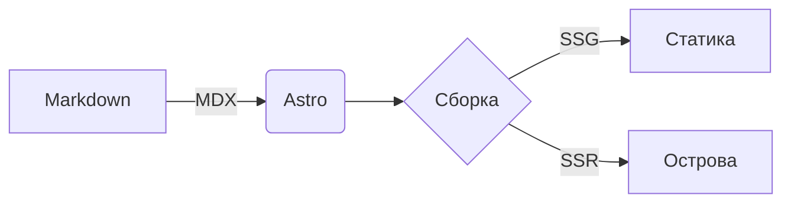

Это тестовый пост, чтобы убедиться, что рендеринг работает.

## Код

```ts
const greet = (name: string): string => `Hello, ${name}!`;
console.log(greet("world"));
```

## Mermaid-диаграмма



## LaTeX

Встроенная формула: $E = mc^2$.

Блочная:

$$
\int_{0}^{\infty} e^{-x^2} \, dx = \frac{\sqrt{\pi}}{2}
$$

## Готово

Если всё выше отрендерилось корректно — конфиг `astro.config.ts` в порядке.
