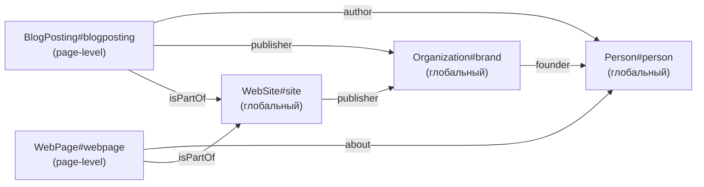

> Большинство руководств по Schema.org для блогов учат: на посте — `<script>` с `BlogPosting`, на главной — с `WebSite`, на about — с `Person`. Это работает, но проигрывает в citability. Краулер видит `Person` из `BlogPosting.author` как «кто-то по имени X», а не как entity, который ещё и `founder of #organization`, который `publisher of #blog`. В посте — пошаговый разбор, как заменить per-page inline-блоки одним `@graph` в `BaseLayout`.

---

## 1. Зачем менять — citability вs SERP

Структурированные данные у разработчика-блогера обычно ассоциируются с одним вопросом: «появится ли мой пост в Google с rich snippet?». Под эту задачу хватает любого валидного `BlogPosting` — пройдёт Rich Results Test, появятся stars/breadcrumb. И этим часто всё кончается: добавили `@type: BlogPosting`, проверили в валидаторе, забыли.

В 2026 году у структурированных данных появился новый, более требовательный потребитель — **LLM-краулер**, который собирает контент для retrieval-augmented generation и для citation. Ему нужен не «ещё один rich snippet», а **связный entity-граф**: чтобы при упоминании автора в одном посте он опознал того же автора в другом, чтобы организация-publisher была одним и тем же объектом на всём сайте, чтобы блог как сущность ссылался обратно на автора.

LLM, выдающий цитату, делает примерно следующее: вытаскивает passage, проверяет окружающую entity-разметку, пытается сопоставить автора с известной сущностью. Если на сайте `Person.name = "Артём Кашута"` встречается в трёх разных Schema.org-блоках без общего `@id`, краулер обязан догадываться, один это человек или три. Если же есть один `Person#person` со стабильным URI, и все остальные узлы (`Organization.founder`, `BlogPosting.author`, `Blog.author`) ссылаются на него через `{"@id": "..."}` — догадки не нужны, граф собран автором.

Это проблема, которую keyword density не решает. Это **entity disambiguation**, и решается она **graph topology**.

| Аспект                    | Per-page inline blocks          | Single `@graph` с `@id`   |
| ------------------------- | ------------------------------- | ------------------------- |
| Google Rich Results       | работает                        | работает                  |
| LLM entity match (Person) | догадка по имени                | гарантирована через `@id` |
| Дублирование данных       | 3-5 копий `Person` на 14 постах | один источник на сайт     |
| Стоимость правки автора   | 14 файлов                       | 1 файл (`person.ts`)      |
| HTML weight               | 3+ скрипта на страницу          | 1 скрипт                  |

Для эпохи SERP-only хватало первого подхода. Для эпохи AI-overviews, citation graphs и retrieval-augmented поиска — нужно второе. Spec нашего блога формулирует это прямо: «move all entity definitions into `src/lib/seo/schema.ts` returning a single `@graph` JSON-LD block; pages contribute a `BlogPosting`/`WebPage` node referencing the global `Person#me` and `Organization#brand` by `@id`» — см. `docs/superpowers/specs/2026-05-02-llm-citable-blog-design.md` § «Schema-graph design».

## 2. Антипаттерн: per-page inline schema

Что эмитит дефолтный Astro-блог, собранный по тутору с какого-нибудь dev.to? Обычно так:

- В `BaseLayout.astro` лежит inline-скрипт с `WebSite` и иногда `Organization`.
- В `PostLayout.astro` лежит ещё один inline-скрипт с `BlogPosting`.
- Если автор увлёкся — добавляется третий скрипт с `BreadcrumbList`. Иногда четвёртый с `Person`.

Почему так получилось — потому что Astro-компоненты иерархически наследуются, и каждый уровень удобно «добивает» свою порцию данных через свой `<script>`. Это работает локально, но плохо масштабируется. У нас в репозитории до Plan 1 было ровно это: `BaseLayout` эмитил один JSON-LD блок, `PostLayout` поверх него добавлял свои два:

```bash
# Pre-Plan 1 (commit 5ed281c~1):
$ git show 5ed281c~1:src/layouts/BaseLayout.astro | grep -c application/ld+json
1
$ git show 5ed281c~1:src/layouts/PostLayout.astro | grep -c application/ld+json
2
```

То есть страница поста содержала **три** `<script type="application/ld+json">` блока. Каждый со своим `Person` (где-то полным, где-то усечённым), без общего `@id`, без перекрёстных ссылок. Краулер, который попадал на пост, видел три не связанных друг с другом entity-облака.

Главные проблемы антипаттерна:

1. **Дублирование `Person`.** Один и тот же автор описан 3-5 раз. Если бы автор сменил `jobTitle` или добавил `sameAs`, надо было бы править во всех файлах. Forget one — и краулер видит конфликт: «у Person с таким именем jobTitle вдруг разный». Это явный signal-to-noise урон.
2. **Разорванный граф.** `BlogPosting.publisher` — это inline-объект `{ "@type": "Organization", "name": "..." }`. Где-то ещё на сайте лежит `Organization` с `founder`-полем. Без общих `@id` валидатор не знает, это один publisher или два.
3. **HTML weight.** Три скрипта вместо одного — это лишние десятки байт на каждый, плюс инфляция payload, особенно если на странице несколько одинаковых полей (e.g. описание автора повторяется четырежды).
4. **Согласованность.** Если автор правит `Person.description` в frontmatter `about.md`, а в `BlogPosting`-builder он зашит как литерал — рассинхрон неизбежен.

## 3. Целевая архитектура — `@graph` с глобальными `@id`

Целевая модель: **один script на странице**, внутри — `@graph`-массив. Глобальные узлы (`Person`, `Organization`, `WebSite`) описаны один раз и идентифицируются стабильными URI. Page-level узлы (`BlogPosting`, `WebPage`, `CollectionPage`, `CreativeWork`) добавляются `BaseLayout`-ом и **ссылаются на глобальные через `@id`**, не дублируя их данные.

Топология:



Что важно в этой картинке:

- **Все стрелки — это `{"@id": "..."}` ссылки.** Никаких inline-копий.
- **`Person#person` — корневой узел графа.** Все entity-страницы (`/about`, `/now`, `/uses`) делают `WebPage.about → Person`. Все посты — `BlogPosting.author → Person`. Сменив `Person`, мы синхронно меняем всё.
- **Page-level узлы добавляются, не заменяя глобальные.** Каждая страница привносит 1-2 новых узла; `Person`/`Organization`/`WebSite` всегда присутствуют.

Стабильные `@id` — это не URL страницы, это URI с фрагментом, например `https://artka.dev/#person`, `https://artka.dev/#brand`. Так принято в JSON-LD: фрагмент-id означает «этот ресурс описан на любой странице, но идентифицируется единым URI».

## 4. Реализация в Astro 5

В Astro 5 SSG/SSR-граница проходит ровно по `BaseLayout`-у: на сборке вычисляются props, рендерится HTML, в нём — статический `<script type="application/ld+json">`. Никаких client-side, никаких rehydration-моргалок. Идеальный момент собрать `@graph` функционально.

### 4.1. `graphIds` — таблица URI

Один файл, в котором перечислены все стабильные идентификаторы:

```ts
// src/lib/seo/nodes-global.ts
const SITE = "https://artka.dev";

export const graphIds = {
  person: `${SITE}/#person`,
  organization: `${SITE}/#brand`,
  website: `${SITE}/#website`,
  blogRu: `${SITE}/#blog-ru`,
  blogEn: `${SITE}/#blog-en`,
} as const;
```

Каждый builder, который ссылается на глобальную сущность, импортирует `graphIds` и использует `{ "@id": graphIds.person }`. Никаких inline-литералов, никаких опечаток в URI.

### 4.2. Builders — pure functions, никаких классов

В соответствии с проектным правилом «никаких классов в прикладном коде» каждый узел — это чистая функция, возвращающая `Record<string, unknown>`:

```ts
// src/lib/seo/nodes-global.ts (фрагмент)
export const buildPersonNode = () => {
  const merged = Array.from(new Set<string>([...person.knowsAbout, ...person.expertiseAreas]));
  return {
    "@type": "Person",
    "@id": graphIds.person,
    name: person.name,
    url: person.url,
    image: person.image,
    jobTitle: person.jobTitle,
    description: person.description,
    knowsAbout: merged,
    sameAs: [...person.sameAs],
    email: person.email,
    subjectOf: person.notableWork.map((w) => ({
      "@type": "CreativeWork",
      name: w.title,
      url: w.url,
      description: w.description,
    })),
  };
};

export const buildOrganizationNode = () => ({
  "@type": "Organization",
  "@id": graphIds.organization,
  name: "artka.dev",
  url: SITE,
  logo: { "@type": "ImageObject", url: `${SITE}/favicon.svg` },
  founder: { "@id": graphIds.person },
});
```

`person` — это импорт из `src/lib/seo/person.ts`, единственного источника правды по автору. Builder складывает `knowsAbout` и `expertiseAreas` в `Set`, чтобы не дублировать ключи. `Organization.founder` — `@id`-ссылка, не inline-копия `Person`.

### 4.3. Оркестратор — `buildGraph`

Функция, которая склеивает глобальные и page-level узлы в один `@graph`:

```ts
// src/lib/seo/schema.ts
import {
  buildPersonNode,
  buildOrganizationNode,
  buildWebSiteNode,
  type Locale,
} from "./nodes-global";

export type GraphNode = Record<string, unknown> & { "@type": string };

export interface GraphInput {
  readonly locale: Locale;
  readonly extraNodes: ReadonlyArray<GraphNode | null>;
}

export interface JsonLdGraph {
  readonly "@context": "https://schema.org";
  readonly "@graph": ReadonlyArray<GraphNode>;
}

export const buildGraph = (input: GraphInput): JsonLdGraph => {
  const globals: GraphNode[] = [
    buildPersonNode(),
    buildOrganizationNode(),
    buildWebSiteNode(input.locale),
  ];
  const extras = input.extraNodes.filter((n): n is GraphNode => n !== null);
  return {
    "@context": "https://schema.org",
    "@graph": [...globals, ...extras],
  };
};
```

API минимальный: вход — locale (чтобы выбрать `inLanguage` для `WebSite`) и список дополнительных узлов (`extraNodes`). Выход — готовый `JsonLdGraph`. `null`-узлы фильтруются — это удобно для опциональных узлов вроде `FAQPage`, builder которых возвращает `null` при пустом массиве вопросов.

### 4.4. `BaseLayout` — единственная точка эмиссии

Весь сайт идёт через `BaseLayout`, и именно он — и только он — эмитит JSON-LD:

```astro
---
// src/layouts/BaseLayout.astro
import { buildGraph, safeJsonLd, type GraphNode } from "~/lib/seo/schema";

interface Props {
  title: string;
  description?: string;
  // ...
  /** Additional JSON-LD nodes to merge into the page @graph. */
  extraSchemaNodes?: ReadonlyArray<GraphNode | null>;
}

const { extraSchemaNodes = [] } = Astro.props;
const locale = getLocaleFromPath(Astro.url.pathname);
---

<head>
  <script
    is:inline
    type="application/ld+json"
    set:html={safeJsonLd(buildGraph({ locale, extraNodes: extraSchemaNodes }))}
  />
</head>
```

Три ключевые детали:

1. **`is:inline`** — Astro не пытается обрабатывать содержимое как JS-модуль.
2. **`set:html`** — мы вставляем уже готовую строку, не давая фреймворку триммить пробелы или экранировать дополнительно.
3. **`safeJsonLd`** — крошечный helper, экранирует `<`, `>`, `&` так, чтобы внутри JSON не оказалось последовательности, которую парсер HTML примет за конец `</script>`. Без него злонамеренный (или просто неудачный) текст в frontmatter мог бы сломать страницу.

```ts
// src/lib/seo/json-ld.ts
export const safeJsonLd = (data: unknown): string =>
  JSON.stringify(data).replace(/</g, "\\u003c").replace(/>/g, "\\u003e").replace(/&/g, "\\u0026");
```

### 4.5. Page-level контракт

Каждый layout/page добавляет свои узлы через `extraSchemaNodes`. Например, `PostLayout`:

```ts
const excerpt = extractArticleBody(post.body ?? "", 800);

const blogPostingNode = buildBlogPostingNode({
  locale,
  canonical,
  title,
  description,
  pubDate,
  updatedDate: updatedDate ?? null,
  image: absoluteCover,
  keywords: tags,
  articleBody: excerpt.text,
  wordCount: excerpt.fullWordCount,
});

const breadcrumbNode = buildBreadcrumbListNode({
  locale,
  blogIndexLabel: t(locale, "blog.title"),
  title,
});

const faqNode = buildFaqPageNode({ canonical, items: faq ?? [] });
```

```astro
<BaseLayout title={title} extraSchemaNodes={[blogPostingNode, breadcrumbNode, faqNode]}>
  <slot />
</BaseLayout>
```

`/blog`, `/projects/<slug>`, `/tags/<tag>`, `/about` — все используют тот же contract, отличаясь только конкретными builders. Один dispatch, ноль дублирования.

## 5. `articleBody` — почему excerpt, а не full body

Поле `articleBody` в `BlogPosting` — самая ценная часть для LLM-краулера: это извлекаемый чанк текста, который можно цитировать. И самая опасная для weight: если положить весь пост в JSON-LD, HTML-страница раздуется в 2-3 раза. Spec формулирует компромисс прямо: «emit first 800 words of plain-text body … add `wordCount` covering the _full_ body».

Excerpt извлекается через mdast: парсим markdown, удаляем code-блоки, mermaid-блоки и inline-html, склеиваем оставшийся текст, режем по 800 слов:

```ts
// src/lib/seo/article-body.ts (фрагмент)
export const extractArticleBody = (markdown: string, maxWords: number) => {
  const tree = unified().use(remarkParse).parse(markdown) as Root;

  const isStrippable = (node: Node): boolean =>
    node.type === "code" || node.type === "inlineCode" || node.type === "html";

  visit(tree, (node, index, parent) => {
    if (parent && typeof index === "number" && isStrippable(node)) {
      (parent as { children: Node[] }).children.splice(index, 1);
      return [SKIP, index];
    }
    return undefined;
  });

  const flat = mdastToString(tree, { includeImageAlt: false }).replace(/\s+/g, " ").trim();
  const words = flat.length > 0 ? flat.split(/\s+/) : [];
  if (words.length <= maxWords) return { text: flat, fullWordCount: words.length };
  return { text: words.slice(0, maxWords).join(" ") + "…", fullWordCount: words.length };
};
```

Почему именно 800 слов:

| Длина     | Pro                        | Con                                     |
| --------- | -------------------------- | --------------------------------------- |
| 50 слов   | мизерный HTML-overhead     | один абзац — мало для LLM-citation      |
| 800 слов  | substantial chunk, ~3-5 KB | +3-5 KB к payload                       |
| Full body | максимум context           | удвоение HTML, реальный hit performance |

Почему именно через mdast, а не regex: в постах живут `<details>`, `<table>`, MDX-компоненты вроде `<Faq>`, `<Tldr>`. Regex по `\`\`\`` сломается на code в indent-стиле или на nested fences. mdast — единственный надёжный способ.

`wordCount` мы оставляем по полному телу, не по excerpt'у — это даёт честный сигнал валидатору и LLM о реальном объёме контента.

## 6. `FAQPage` как side-effect MDX-компонента

Один из дизайн-целей Plan 1 — **снять с автора cognitive load на structured data**. Автор не должен помнить, что у `FAQPage` есть `mainEntity`, что внутри `Question` нужен `acceptedAnswer`, что текст ответа экранируется. Автор должен заполнить frontmatter и забыть.

Решение: `frontmatter.faq` — единственный источник. PostLayout читает массив:

```ts
const faqNode = buildFaqPageNode({ canonical, items: faq ?? [] });
```

`buildFaqPageNode` либо возвращает готовый `FAQPage`-узел, либо `null` (фильтруется в `buildGraph`). Параллельно тот же массив отдаётся в `<Faq>`-компонент, который рендерит видимые `<details>`-блоки с тем же текстом. Один источник — два потребителя: визуальный layer и structured layer. Рассинхрон невозможен.

Builder тривиален:

```ts
export const buildFaqPageNode = (input: FaqPageInput) => {
  if (input.items.length === 0) return null;
  return {
    "@type": "FAQPage",
    "@id": `${input.canonical}#faq`,
    mainEntity: input.items.map((it) => ({
      "@type": "Question",
      name: it.question,
      acceptedAnswer: { "@type": "Answer", text: it.answer },
    })),
  };
};
```

Frontmatter, который автор пишет:

```yaml
faq:
  - question: "Чем агент отличается от чат-бота?"
    answer: "Чат-бот — это model.complete(messages): принимает текст…"
```

И всё. Дальше — автоматика.

## 7. Замеры до/после

После Plan 1 на странице `/blog/01-introduction/` остался ровно **один** `<script type="application/ld+json">` блок. Реальный измеренный факт:

```bash
$ grep -c "application/ld+json" dist/client/blog/01-introduction/index.html
1
```

До Plan 1 (commit `5ed281c~1`) было два источника inline-скриптов:

```bash
$ git show 5ed281c~1:src/layouts/BaseLayout.astro | grep -c application/ld+json  # 1
$ git show 5ed281c~1:src/layouts/PostLayout.astro | grep -c application/ld+json  # 2
```

То есть на странице поста суммарно **3 блока**. Стало **1**.

| Метрика                                                        | Pre-Plan 1             | Post-Plan 1                 |
| -------------------------------------------------------------- | ---------------------- | --------------------------- |
| `<script type="application/ld+json">` блоков на странице поста | 3                      | 1                           |
| Общий контейнер                                                | нет                    | `@graph`                    |
| Стабильный `Person@id`                                         | нет                    | `https://artka.dev/#person` |
| Перекрёстные `@id`-ссылки между узлами                         | 0                      | 8+                          |
| Источник правды по автору                                      | разбросан по layout-ам | `src/lib/seo/person.ts`     |

Реальный JSON-LD страницы `/blog/01-introduction/`, извлечённый из `dist/client/blog/01-introduction/index.html`, выглядит так (фрагмент, `articleBody` урезан до многоточия, FAQ-узел сокращён):

```json
{
  "@context": "https://schema.org",
  "@graph": [
    {
      "@type": "Person",
      "@id": "https://artka.dev/#person",
      "name": "Артём Кашута",
      "url": "https://artka.dev/about",
      "jobTitle": "Software engineer · backend & AI agent engineering",
      "knowsAbout": ["Claude Code", "AI agent engineering", "Node.js", "TypeScript", "Astro", "…"],
      "email": "a@artka.dev",
      "subjectOf": [
        {
          "@type": "CreativeWork",
          "name": "Claude Code Guide (RU, 14 частей)",
          "url": "https://artka.dev/blog"
        }
      ]
    },
    {
      "@type": "Organization",
      "@id": "https://artka.dev/#brand",
      "name": "artka.dev",
      "logo": { "@type": "ImageObject", "url": "https://artka.dev/favicon.svg" },
      "founder": { "@id": "https://artka.dev/#person" }
    },
    {
      "@type": "WebSite",
      "@id": "https://artka.dev/#website",
      "url": "https://artka.dev",
      "inLanguage": "ru-RU",
      "publisher": { "@id": "https://artka.dev/#brand" },
      "potentialAction": {
        "@type": "SearchAction",
        "target": "https://artka.dev/search?q={search_term_string}",
        "query-input": "required name=search_term_string"
      }
    },
    {
      "@type": "BlogPosting",
      "@id": "https://artka.dev/blog/01-introduction/#blogposting",
      "headline": "01. Что такое Claude Code: harness, agent loop и ваше место в нём",
      "datePublished": "2026-04-23T00:00:00.000Z",
      "author": { "@id": "https://artka.dev/#person" },
      "publisher": { "@id": "https://artka.dev/#brand" },
      "mainEntityOfPage": "https://artka.dev/blog/01-introduction/",
      "inLanguage": "ru-RU",
      "isPartOf": { "@id": "https://artka.dev/#blog-ru" },
      "articleBody": "Перед тем как разбирать skills и subagents, надо договориться о терминах…",
      "wordCount": 574
    },
    {
      "@type": "BreadcrumbList",
      "itemListElement": [
        { "@type": "ListItem", "position": 1, "name": "Главная", "item": "https://artka.dev/" },
        { "@type": "ListItem", "position": 2, "name": "Статьи", "item": "https://artka.dev/blog" },
        { "@type": "ListItem", "position": 3, "name": "01. Что такое Claude Code…" }
      ]
    },
    {
      "@type": "FAQPage",
      "@id": "https://artka.dev/blog/01-introduction/#faq",
      "mainEntity": [
        {
          "@type": "Question",
          "name": "Чем агент отличается от чат-бота?",
          "acceptedAnswer": { "@type": "Answer", "text": "…" }
        }
      ]
    }
  ]
}
```

Что можно увидеть глазами и что зафиксирует валидатор:

1. **Один `Person`, на него ссылается всё.** `Organization.founder`, `BlogPosting.author` — оба `{ "@id": "https://artka.dev/#person" }`. Никаких догадок о тождестве.
2. **`Organization` — публичный publisher.** `WebSite.publisher` ссылается на тот же `Organization`. `BlogPosting.publisher` — на тот же. Граф связан.
3. **`isPartOf` цепочка для блога.** `BlogPosting.isPartOf → Blog#blog-ru → publisher → Organization`. Краулер видит вложенность и принадлежность.
4. **`articleBody` excerpt — substantial.** ~574 слова поста уложены в одно поле. `wordCount` отражает полный объём. LLM получает текст для citation, HTML — не раздувается.
5. **FAQ — вместе со всеми, не отдельно.** Не отдельный script-блок, а узел того же `@graph`. Меньше блоков — меньше ловушек для парсера.

Schema.org validator и Google Rich Results Test принимают этот `@graph` без замечаний _(скриншоты — owner to fill)_. Главное — JSON pretty-print'ится без `[object Object]`, без unescaped кавычек, без сломанных дат: всё в норме после `safeJsonLd`-обёртки.

---

### Что дальше

Описанное выше — **Plan 1** в нашем repo. Дальше базу мы расширяем для новых типов сущностей (`/projects/<slug>` через `CreativeWork`, `/uses` через `WebPage.about`), и для retrieval-слоя через `llms.txt`. Но фундамент — `buildGraph` + стабильные `@id` — обязан встать первым.

Если вы видите 2-3 inline JSON-LD скрипта на странице поста — это место, с которого стоит начинать миграцию. Один файл `schema.ts`, один `extraSchemaNodes`-prop — и сайт превращается из набора разрозненных entity-облаков в связный citable-узел.
