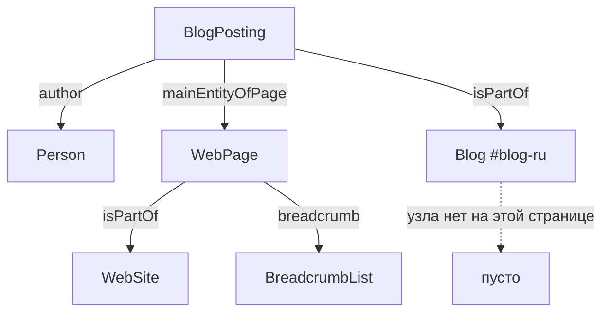

> На каждой статье этого сайта висела ссылка в пустоту. Узел `BlogPosting` ссылался через `isPartOf` на узел блога, которого на странице статьи не было. Ни Schema Markup Validator, ни Rich Results Test об этом не сказали ни слова, потому что для них это не ошибка. Разбираю, как собрать граф так, чтобы такие вещи ловились, чем безопасно вставлять JSON внутрь `script`, и что разметка даёт, а что ей приписывают.

---

## 1. Что такое `@graph` по спецификации

У статьи есть автор, сайт и собственный адрес. Когда эти сведения собираются в разных компонентах, легко получить двух авторов с разными адресами или дату обновления, не совпадающую с видимой страницей. Граф удобен тем, что такие расхождения заметны.

Полезно знать, что означает `@graph` формально. Когда на верхнем уровне документа нет других ключей кроме `@graph` и необязательного `@context`, спецификация JSON-LD 1.1 трактует его так: «`@graph` is considered to express the otherwise implicit default graph». То есть это не именованный граф и не особая конструкция, а обычный набор узлов с общим контекстом. Спецификация прямо называет практическую пользу: «a top-level map with a `@graph` property can be useful for saving the repetition of `@context`».

Отсюда честная формулировка: один граф это решение об удобстве сопровождения кода. Несколько отдельных корректных блоков JSON-LD на странице допустимы, Google описывает оба способа и ни один не называет предпочтительным.

Сокращённый пример связей:

```json
{
  "@context": "https://schema.org",
  "@graph": [
    { "@type": "Person", "@id": "https://artka.dev/#person", "name": "Artyom Kashuta" },
    {
      "@type": "WebSite",
      "@id": "https://artka.dev/#website",
      "url": "https://artka.dev/",
      "name": "artka.dev"
    },
    {
      "@type": "WebPage",
      "@id": "https://artka.dev/blog/example/#webpage",
      "url": "https://artka.dev/blog/example/",
      "isPartOf": { "@id": "https://artka.dev/#website" }
    },
    {
      "@type": "BlogPosting",
      "@id": "https://artka.dev/blog/example/#article",
      "author": { "@id": "https://artka.dev/#person" },
      "mainEntityOfPage": { "@id": "https://artka.dev/blog/example/#webpage" }
    }
  ]
}
```

Инвариант: адрес страницы в графе, в canonical, в карте сайта и во внутренних ссылках обозначает одну и ту же форму URL. На этом сайте с завершающим слешем. У английской версии собственный адрес под `/en/`, языки связываются через hreflang, а не подменой canonical на русский оригинал.

Кстати про две языковые версии. У Google есть отдельное указание, которое к этому прямо относится: «If you have duplicate pages for the same content, we recommend placing the same structured data on all page duplicates, not just on the canonical page».

---

## 2. Что Google действительно читает и где

Самое частое заблуждение звучит так: положим все сущности на каждую страницу, хуже не будет. Хуже действительно не будет, но и пользы от некоторых из них там не появится.

| Тип           | Обязательные свойства         | Где Google это читает                              |
| ------------- | ----------------------------- | -------------------------------------------------- |
| Article       | нет ни одного                 | на странице статьи                                  |
| Person        | `name` внутри `author`        | как автор статьи, и как `mainEntity` у ProfilePage  |
| ProfilePage   | `mainEntity`                  | на странице автора или «обо мне»                    |
| WebSite       | нет обязательных              | только на главной домена или поддомена              |
| Organization  | нет обязательных              | на главной или на одной странице об организации     |

Про Article стоит процитировать дословно, потому что это меняет тон всего разговора: «There are no required properties; instead, add the properties that apply to your content». Речь не про выполнение требований, а про то, чтобы дать столько уместных свойств, сколько есть.

Рекомендованные для Article: `author`, `author.name`, `author.url`, `datePublished`, `dateModified`, `headline`, `image`. Тип должен быть одним из трёх: Article, NewsArticle, BlogPosting.

Про WebSite оговорка важная: разметку для выбора имени сайта Google читает только на главной, и там же просит не плодить второй блок. Дословно: «avoid creating an additional `WebSite` structured data block on your home page if you can help it». В графе статьи узел WebSite нужен как точка, к которой привязывается `isPartOf`, а не как заявка на имя сайта.

Отдельно про даты. У Google есть страница специально про них, и требование там взаимное: добавьте видимую дату, подпишите её словами, и «Ensure that the date (and optional time and timezone) match between the equivalent user-visible and structured values». Плюс совет: «Minimize the presence of other dates on the page». То есть проверка «дата публикации не изменилась» неполна без проверки «дата в разметке совпадает с датой на экране».

Полезная деталь из собственного примера Google для ProfilePage: там Person и Article связаны через `@id`, причём относительным фрагментом `#main-author`, а не абсолютным адресом. Абсолютный идентификатор устойчивее при склейке документов, но утверждать, что относительный неверен, нельзя.

---

## 3. Ошибка, которую не ловит ни один валидатор

Теперь про то, с чего начинался этот текст.

На каждой странице статьи узел `BlogPosting` ссылался через `isPartOf` на узел блога с идентификатором `https://artka.dev/#blog-ru`. Сам этот узел выводился только на `/blog/`. Получалось так:



Единственная связь статьи с изданием не разрешалась ни на одной статье обоих языков. Ровно там, ради чего граф и собирался.

Почему молчали валидаторы. Спецификация JSON-LD 1.1 определяет ссылку на узел так: «A node reference is a node object containing only the `@id` property, which may represent a reference to a node object found elsewhere in the document». Ключевое слово «may». Если узла с таким идентификатором в документе нет, получается корректный, но пустой узел: адрес есть, свойств нет. Это не ошибка ни по спецификации, ни по правилам Google.

Похожая история обнаружилась на страницах проектов: у коллекции не было поля `breadcrumb`, хотя хлебные крошки на странице выводились, а у страницы проекта не было `mainEntity`, поэтому описание работы висело само по себе.

Вывод простой. Валидаторы проверяют каждый узел по отдельности, а связность графа не проверяет никто. Значит проверять её надо самому, и это делается за полчаса (раздел 7).

---

## 4. Что нарушение, а что просто бесполезно

Разница между этими двумя категориями существенная, и её стоит держать в голове, потому что за первую бывает ручная санкция, а за вторую ничего.

| Что                                          | Нарушение? | Что происходит                                        |
| -------------------------------------------- | ---------- | ------------------------------------------------------ |
| Разметка содержимого, невидимого читателю    | да         | ручная санкция, потеря права на расширенный показ      |
| Вводящая в заблуждение разметка              | да         | то же                                                   |
| Выдача себя за другого человека или компанию | да         | то же                                                   |
| Устаревшая неподдерживаемая разметка         | нет        | никакого эффекта, ошибок в отчётах не будет             |
| Висячая ссылка `@id`                          | нет        | корректный пустой узел, смысла ноль                     |
| Два узла Person с разными `@id`               | нет        | две разные сущности, поисковик решает сам               |
| Микроданные и JSON-LD на одной странице      | нет        | правила не запрещают, но сущности будут расходиться     |

Про нарушения Google формулирует прямо: «Don't mark up content that is not visible to readers of the page. For example, if the JSON-LD markup describes a performer, the HTML body must describe that same performer». Последствие санкции тоже названо точно: «A structured data manual action means that a page loses eligibility for appearance as a rich result; it doesn't affect how the page ranks in Google web search».

Это единственный пункт из списка, который Google называет нарушением. Всё остальное к нарушениям не относится, и пугать себя ими не надо.

Про смешение форматов стоит сказать аккуратно: запрета нет, Google поддерживает JSON-LD, микроданные и RDFa и нигде не запрещает их сочетать. Риск не в санкции, а в том, что получится две независимые копии одной сущности, которые разойдутся при первой же правке. У меня на странице статьи подпись под заголовком была размечена микроданными и создавала вторую сущность Person без адреса и без ссылок, при том что полная уже лежала в JSON-LD. Поисковик видел двух разных людей на одной странице.

---

## 5. Безопасная вставка: две школы и реальная уязвимость

Стандарт HTML описывает ограничения на содержимое элемента `script` и даёт прямой совет: «always escape an ASCII case-insensitive match for "`<!--`" as "`\x3C!--`", "`<script`" as "`\x3Cscript`", and "`</script`" as "`\x3C/script`" when these sequences appear in literals in scripts».

Обратите внимание: опасных последовательностей три, а не одна, и совпадение нечувствительно к регистру, то есть `</ScRiPt` тоже закроет элемент раньше времени.

Тип `application/ld+json` делает элемент блоком данных, который браузер не исполняет, но разбор содержимого от типа не зависит. Ограничения действуют одинаково.

Дальше начинается развилка, о которой обычно не пишут.

**Способ первый, по букве спецификации JSON-LD.** Её раздел про вставку в HTML помечен как ненормативный и советует заменять пять символов на мнемоники:

```ts
const ENTITIES: Record<string, string> = {
  "&": "&amp;",
  "<": "&lt;",
  ">": "&gt;",
  '"': "&quot;",
  "'": "&apos;",
};

export const safeJsonLdEntities = (value: unknown): string =>
  JSON.stringify(value).replace(/[&<>"']/g, (c) => ENTITIES[c] ?? c);
```

Так сделано в библиотеке самого Google `react-schemaorg`, со ссылкой в комментарии ровно на этот раздел. Но у способа есть цена, и спецификация её честно называет: «the content will remain escaped after processing through the JSON-LD API». То есть в разобранном значении останется `&lt;`, а не `<`. В примере самой спецификации так и выходит.

**Способ второй, через штатное экранирование JSON.**

```ts
export const safeJsonLd = (value: unknown): string =>
  JSON.stringify(value)
    .replace(/</g, "\\u003c")
    .replace(/>/g, "\\u003e")
    .replace(/&/g, "\\u0026")
    .replace(/
/g, "\\u2028")
    .replace(/
/g, "\\u2029");
```

Последовательность `<` это обычное экранирование JSON, которое разбирается обратно в исходный символ. В байтах страницы `</script` и `<!--` не возникает, а значение остаётся точным. Формально это не то, что написано в ненормативном разделе, но ничему не противоречит.

Разница на строке, содержащей `</script>`:

| Способ            | В HTML                  | После разбора        |
| ----------------- | ----------------------- | -------------------- |
| Мнемоники         | `&lt;/script&gt;`       | `&lt;/script&gt;`    |
| `<`          | `</script>`   | `</script>`          |

Для технического блога, где в тексте разметки попадаются фрагменты HTML, второй способ практичнее. Выбирать стоит осознанно, а не молча.

Что это не теория, подтверждает история библиотеки `google/react-schemaorg`. Задача номер девять, заведена 16 марта 2020: при отрисовке на сервере данные попадали в HTML без экранирования, и значение вида `</script><script>alert('xss')</script>` выходило за пределы блока. Из описания: «There's a potential XSS problem when using this library with server-side-rendering (which is arguably one of the most prominent use-cases to render json-ld)». Задача закрыта, экранирование добавлено.

В Astro это особенно важно, потому что директива `set:html` намеренно ничего не экранирует. Документация предупреждает прямо: «The value is not automatically escaped by Astro! Be sure that you trust the value, or that you have escaped it manually before passing it to the template», и «Forgetting to do this will open you up to Cross Site Scripting (XSS) attacks».

Правильный вызов выглядит так:

```astro
<script type="application/ld+json" set:html={safeJsonLd(graph)} />
```

Склейка строк из frontmatter в шаблоне сюда не годится.

---

## 6. Три инструмента, три разные проверки

Валидный JSON, корректная разметка Schema.org и право на конкретный поисковый формат это три разные вещи, и проверяются они тремя разными способами.

| Инструмент              | Что проверяет                                         | Чего не делает                                       |
| ----------------------- | ----------------------------------------------------- | ---------------------------------------------------- |
| Schema Markup Validator | любую разметку Schema.org, без привязки к Google      | не даёт предупреждений, специфичных для Google        |
| Rich Results Test       | только типы, которые Google поддерживает для показа   | не проверяет произвольную разметку Schema.org         |
| URL Inspection          | как Google видит конкретный адрес на живом сайте      | не валидатор разметки, нужны права на сайт            |

Schema Markup Validator это бывший Google Structured Data Testing Tool, у которого убрали проверки, специфичные для Google, и передали сообществу Schema.org. Отдельная особенность: он не подтягивает сторонние контексты, «in the case of JSON-LD, this means that it will not fetch or interpret other @context URLs».

Rich Results Test работает по отрисованному коду, то есть выполняет скрипты, и требует, чтобы все ресурсы страницы были доступны анонимному посетителю: «All page resources must be accessible by an anonymous user accessing the code from the internet». При недогрузке ресурсов результаты будут скакать от запуска к запуску.

Сам Google в инструкции для Article называет три шага, а не два: проверить в Rich Results Test, выложить несколько страниц, и посмотреть их через URL Inspection, потому что тест и живой индекс это разные вещи.

И честная граница, которую стоит держать в голове: «Google does not guarantee that your structured data will show up in search results, even if your page is marked up correctly according to the Rich Results Test». Среди перечисленных причин есть и такая: «The structured data is incorrect in a way that the Rich Results Test was not able to catch».

Новых официальных валидаторов после мая 2026 не появилось. Появились два инструмента измерения: отчёты по генеративному ИИ в Search Console (раскатаны на все сайты к 31 августа 2026, только показы) и AI Performance в Bing Webmaster Tools (публичное превью с 10 февраля 2026).

---

## 7. Линтер графа за полчаса

То, чего не делает ни один валидатор, делается коротким скриптом: собрать все объявленные `@id`, собрать все использованные ссылки и показать разницу.

```ts
interface Dangling {
  readonly owner: string;
  readonly ref: string;
}

/** Ссылки вида {"@id": "..."} , для которых в этом же графе нет узла. */
export const findDangling = (graph: ReadonlyArray<Record<string, unknown>>): Dangling[] => {
  const declared = new Set(
    graph.flatMap((n) => (typeof n["@id"] === "string" ? [n["@id"] as string] : [])),
  );
  const out: Dangling[] = [];

  const walk = (value: unknown, owner: string): void => {
    if (Array.isArray(value)) return void value.forEach((v) => walk(v, owner));
    if (value === null || typeof value !== "object") return;
    const obj = value as Record<string, unknown>;
    const keys = Object.keys(obj);
    if (keys.length === 1 && keys[0] === "@id" && typeof obj["@id"] === "string") {
      if (!declared.has(obj["@id"] as string)) out.push({ owner, ref: obj["@id"] as string });
      return;
    }
    Object.values(obj).forEach((v) => walk(v, owner));
  };

  graph.forEach((node) => walk(node, String(node["@type"] ?? "unknown")));
  return out;
};
```

Одна оговорка обязательна, иначе проверка будет шуметь. Ссылки на узел другого языка (`#website-en` с русских страниц и наоборот) по замыслу указывают на узел другого документа. Их надо внести в список разрешённых исключений. То же касается ссылок на уроки со страницы курса: узел живёт на своей странице.

Второй проверкой стоит сравнить разметку с тем, что видно на экране: `headline` из графа с текстом заголовка первого уровня в отрисованном HTML, и `dateModified` с видимой датой. Это прямо отрабатывает требование Google про совпадение дат и запрет размечать невидимое.

Обе проверки естественно ложатся в шаг сборки рядом с остальными. У меня они теперь живут в `pnpm verify:seo-build`, и именно их отсутствие позволило висячей ссылке жить незамеченной.

---

## 8. Чего разметка не даёт

Здесь полезно разделить то, что подтверждено, и то, что приписывают.

**Галерея расширенных результатов сокращается уже третий год.** Сейчас в ней 25 типов. Убрали: HowTo (2023), окно поиска по сайту (2024), семь типов включая Course Info и Claim Review (2025), practice problems (январь 2026), FAQPage (2026). Мотивировка Google при отмене семи типов: «our analysis shows that they're not commonly used in Search, and we found that these specific displays are no longer providing significant additional value for users». И там же важное: «This update won't affect how pages are ranked».

У FAQPage четыре даты, а не одна: показ прекратился 7 мая 2026, показатель и поддержка в Rich Results Test сняты в июне 2026, поддержка в Search Console API убрана в августе 2026. Практическое следствие: пустой результат теста по этому типу больше не признак поломки.

**Разметка для генеративных ответов не требуется.** Google опубликовал это отдельным руководством 15 мая 2026, в разделе развенчания мифов: «Structured data isn't required for generative AI search, and there's no special schema.org markup you need to add. However, it's a good idea to continue using it as part of your overall SEO strategy, as it helps with being eligible for rich results on Google Search». Условие попадания в генеративные функции там же названо прямо: страница должна быть проиндексирована и иметь право на показ со сниппетом.

В документации для издателей у OpenAI и Perplexity структурированные данные не упоминаются вообще. У Microsoft единственное положительное высказывание это реплика сотрудника Bing на конференции в марте 2025, переданная третьим лицом в социальной сети. Это не документация.

**Единственное опубликованное измерение показало ноль.** Исследование Ahrefs от 11 мая 2026: 1885 страниц, добавивших разметку с августа 2025 по март 2026, сопоставлены примерно с четырьмя тысячами контрольных, метод разности разностей, окно 30 дней до и после. Результат по цитированию в ответах: AI Overviews минус 4,6 процента (статистически значимо), AI Mode плюс 2,4 процента и ChatGPT плюс 2,2 процента (неотличимо от шума). Вывод авторов дословно: «Adding schema produced no major uplift in citations on any platform».

Оговорки приводить обязательно вместе с цифрами: это исследование поставщика инструментов, а не независимое; измерялось цитирование в ответах, а не расширенные результаты в выдаче; обе группы страниц шли по нисходящей траектории до вмешательства; выборка состояла из страниц, которые уже цитировались.

**А что подтверждено?** Ровно одно конкретное преимущество связывания, и оно из требований Google: «If there are items that are more helpful when they are linked together (for example, a recipe and a video), use `@id` in both the recipe and the video items to specify that the video is about the recipe on the page. If you didn't link the items together, Google Search may not know that it can show the video as a Recipe rich result». Для рецепта с видео эффект назван. Для связки автора и статьи такого утверждения нет, и распространять одно на другое нельзя.

Публичных сравнений «связный граф против независимых блоков» не существует ни у Google, ни в академических работах, ни у поставщиков инструментов. Это надо говорить прямо.

Напоследок пример того, как устаревший совет живёт своей жизнью. В академической работе про оптимизацию под генеративные системы, вышедшей 31 марта 2026, есть фраза: «Google recommends JSON-LD structured data with emphasis on FAQ and How-to schemas for AI search visibility». На момент выхода работы HowTo был отменён более двух лет, а FAQ отменялся в те же недели. Привычка сверяться с журналом изменений Google стоит дороже, чем кажется.

---

## Итог

Разметка нужна ради права на расширенные результаты и ради собственной дисциплины в данных. Ради попадания в ответы моделей она не нужна: Google сказал это прямо, остальные не сказали ничего, а единственное измерение показало ноль.

При этом собирать её в граф со стабильными идентификаторами всё равно стоит, только по другой причине. Один граф означает один источник истины для автора, сайта и страницы, и расхождения в нём заметны. Заметны, правда, не валидаторам: связность графа не проверяет никто, кроме вас. Ссылка в пустоту на каждой статье этого сайта дожила до сентября именно поэтому. Тридцать строк проверки в шаге сборки стоят дешевле, чем уверенность, что всё в порядке.

Соседние темы: [доступ роботов и четыре разные задачи](/blog/robots-txt-ai-crawlers-2026/) и [разбор того, почему сайт не индексировался](/blog/crawled-not-indexed-astro-audit/).

---

**Источники:**

- [Google: Article](https://developers.google.com/search/docs/appearance/structured-data/article) — отсутствие обязательных свойств, рекомендованные, правила про автора
- [Google: общие требования к структурированным данным](https://developers.google.com/search/docs/appearance/structured-data/sd-policies) — что считается нарушением, связывание через @id, дубли страниц
- [Google: галерея расширенных результатов](https://developers.google.com/search/docs/appearance/structured-data/search-gallery) — текущий состав из 25 типов
- [Google: FAQPage](https://developers.google.com/search/docs/appearance/structured-data/faqpage) — четыре даты прекращения поддержки
- [Google: ProfilePage](https://developers.google.com/search/docs/appearance/structured-data/profile-page) — обязательные свойства и пример связывания через @id
- [Google: имена сайтов](https://developers.google.com/search/docs/appearance/site-names) — WebSite читается только на главной
- [Google: даты публикации](https://developers.google.com/search/docs/appearance/publication-dates) — совпадение видимой и размеченной даты
- [Google: руководство по генеративным функциям](https://developers.google.com/search/docs/fundamentals/ai-optimization-guide) — разметка для них не требуется
- [Google: упрощение выдачи, 12 июня 2025](https://developers.google.com/search/blog/2025/06/simplifying-search-results) — отмена семи типов и мотивировка
- [Google: HowTo и FAQ, 8 августа 2023](https://developers.google.com/search/blog/2023/08/howto-faq-changes) — неиспользуемая разметка не создаёт проблем
- [Google: ручные санкции](https://support.google.com/webmasters/answer/9044175) — формулировка санкции за разметку
- [Справка по Rich Results Test](https://support.google.com/webmasters/answer/7445569) — что проверяет и требования к доступности ресурсов
- [Schema Markup Validator](https://schema.org/docs/validator.html) — происхождение инструмента и его границы
- [HTML Living Standard, раздел 4.12.1](https://html.spec.whatwg.org/multipage/scripting.html) — три опасные последовательности внутри script
- [JSON-LD 1.1](https://www.w3.org/TR/json-ld11/) — определение ссылки на узел, граф по умолчанию, раздел про вставку в HTML
- [Astro: директивы](https://docs.astro.build/en/reference/directives-reference/) — set:html не экранирует значение
- [google/react-schemaorg, задача №9](https://github.com/google/react-schemaorg/issues/9) — уязвимость при отрисовке на сервере
- [Ahrefs: влияние разметки на цитирование, 11 мая 2026](https://ahrefs.com/blog/schema-ai-citations/) — 1885 страниц, прироста нет
