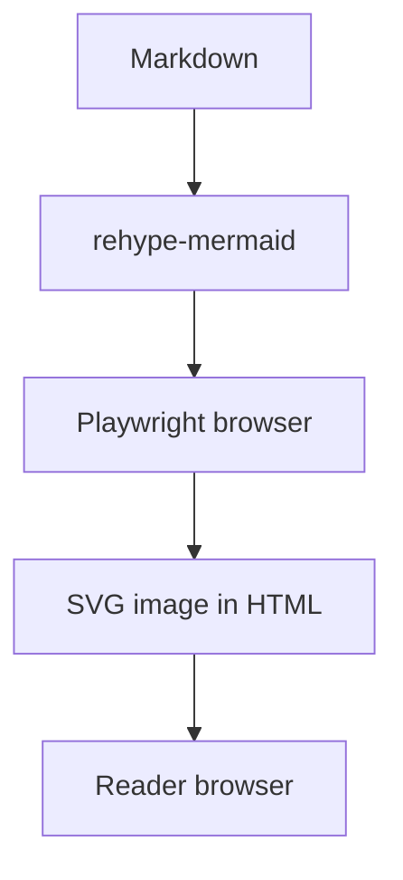

На техническом сайте диаграмма должна читаться вместе с текстом. Если её можно подготовить при сборке, браузеру читателя не нужно отдельно загружать Mermaid и превращать исходник в изображение. Цена этой схемы — работа рендерера в окружении сборки.

Прежняя версия приводила 11,6 и 6,3 секунды для набора из 32 диаграмм. Здесь нет сохранённых логов и достаточных параметров, чтобы воспроизвести эти результаты. Числа убраны; ниже — действующая конфигурация сайта и способ измерить собственную сборку.

## Конфигурация этого сайта

На дату обновления artka.dev использует Astro 7, `@astrojs/markdown-remark` и `rehype-mermaid`. Полная конфигурация лежит в файле `astro.config.ts` этого проекта; исходный код сайта не опубликован, мой профиль на GitHub — [node-develop](https://github.com/node-develop). Для понимания Mermaid достаточно такого сокращения:

```typescript
import { defineConfig } from "astro/config";
import { unified } from "@astrojs/markdown-remark";
import mdx from "@astrojs/mdx";
import rehypeMermaid from "rehype-mermaid";

export default defineConfig({
  integrations: [mdx()],
  markdown: {
    processor: unified({
      rehypePlugins: [[rehypeMermaid, { strategy: "img-svg", dark: true }]],
    }),
  },
});
```

Astro 7 сменил Markdown-процессор по умолчанию. Для remark/rehype-плагинов нужно явно сохранить unified-пайплайн; это описано в [руководстве миграции](https://docs.astro.build/en/guides/upgrade-to/v7/). MDX в конфигурации этого репозитория наследует настройки Markdown.

Это сокращённый пример: production-конфиг сайта также содержит обработку внутренних ссылок, заголовков, изображений и LaTeX. Заменять его целиком приведённым фрагментом не следует.

## Что должно получиться



После сборки откройте HTML статьи в `dist/client/` и найдите изображение этой диаграммы с SVG в data URI. Затем проверьте опубликованную страницу с отключённым JavaScript. Сама диаграмма должна оставаться доступной. Это не обещание нулевого JavaScript на всём сайте: поиск, тема и другие компоненты могут иметь собственные скрипты.

Проверьте мобильную ширину, светлую и тёмную тему. Мелкий текст, обрезанные стрелки и горизонтальная прокрутка — реальные проблемы чтения, даже если сборка завершилась успешно. Смысл диаграммы стоит кратко повторить в окружающем тексте: здесь Markdown обрабатывается при сборке, а читатель получает готовый SVG.

## Как измерить стоимость сборки

Зафиксируйте commit, версии Node и зависимостей, машину и число Mermaid-блоков. Сравните один и тот же набор страниц в двух временных копиях: с рендерингом и с заранее подготовленными статическими SVG. Оба варианта должны публиковать одинаковый материал.

Разделите измерения:

- установка зависимостей и браузера;
- первый запуск в новом окружении;
- повторная сборка с тем же окружением;
- полное время CI, включая загрузку образа и артефактов.

Для команд проекта можно использовать `/usr/bin/time -p pnpm build`, сохраняя stdout и stderr. Сделайте несколько запусков каждого варианта и покажите все результаты, медиану и разброс. Один холодный и один тёплый запуск не позволяют приписать всю разницу Mermaid: меняются и другие кэши.

В CI браузер и его системные зависимости должны быть установлены до сборки. Версию браузера согласуйте с версией Playwright в lockfile. Если рендер падает, сохраните ошибку и исходную диаграмму; не заменяйте её молча пустым блоком.

## Когда выбрать mermaid-cli

В прежнем тексте ошибочно утверждалось, что CLI требует отдельный процесс на каждую диаграмму и не обрабатывает Markdown. [mermaid-cli](https://github.com/mermaid-js/mermaid-cli) умеет преобразовывать Mermaid-блоки Markdown в SVG-файлы и ссылки на них:

```bash
mmdc -i readme.template.md -o readme.md
```

CLI удобен для явных файлов-артефактов и общего набора диаграмм. Rehype удобен, когда диаграмма живёт рядом с абзацем и должна обрабатываться тем же пайплайном. Выбирайте по организации контента, а производительность сравнивайте на своём корпусе.

О метаданных готового HTML — [разбор JSON-LD в Astro](/blog/json-ld-graph-astro/).
