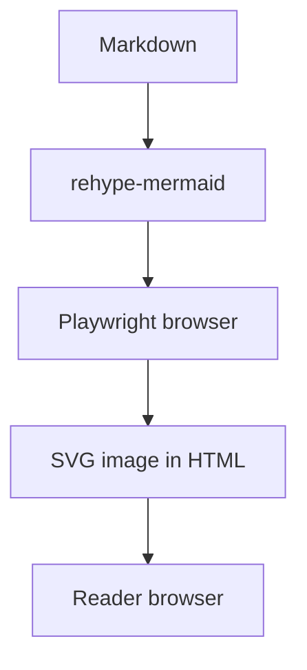

Чтобы диаграмма Mermaid читалась без JavaScript, её можно превратить в SVG при сборке сайта. На artka.dev это делает `rehype-mermaid`: он запускает рендер через Playwright и вставляет готовое изображение в HTML. Браузеру читателя Mermaid уже не нужен; браузер для рендера и его системные зависимости нужны в окружении сборки.

Пример рассчитан на конфигурацию этого репозитория с Astro 7. Стоимость рендера нужно измерить на своём контенте: воспроизводимых замеров для обещания конкретного времени сборки здесь нет.

Представьте документацию сервиса: автор объясняет путь запроса от API к очереди, а рядом хранит Mermaid-блок с теми же переходами. При изменении архитектуры удобно исправить абзац и схему в одном pull request. Но текстовый исходник ещё нужно превратить в изображение. Если этот шаг выполняется на клиенте, готовность диаграммы зависит от загрузки и выполнения её рендерера. Для статической статьи хочется получить страницу, на которой объяснение уже собрано целиком.

Рендер во время сборки решает именно эту задачу. Разработчик продолжает редактировать схему как текст, а результат проверяет до выкладки. При этом работа не исчезает: она переезжает в локальную сборку и CI. Там появляется браузерная зависимость, а ошибка одной схемы может остановить подготовку страницы. Поэтому решение стоит оценивать сразу с двух сторон: что получает читатель и что теперь нужно поддерживать владельцу сайта.

Для примера с документацией полезный результат вполне конкретен: схема входит в готовый HTML, читается на телефоне, сохраняет контраст в выбранной теме и не требует запуска Mermaid у посетителя. Ниже — путь от настройки к этим проверкам, а затем способ выяснить, устраивает ли вас цена такого подхода.

## Как подключить Mermaid к Markdown в Astro 7

В Astro 7 Markdown по умолчанию обрабатывает Sätteri. Для существующих remark/rehype-плагинов можно сохранить `unified()` из `@astrojs/markdown-remark`, как описано в [руководстве миграции Astro](https://docs.astro.build/en/guides/upgrade-to/v7/#new-default-markdown-processor-sätteri). В этом репозитории выбран именно такой вариант.

В `astro.config.ts` подключите плагин к Markdown-процессору. Сокращённый пример:

```typescript
import { defineConfig } from "astro/config";
import { unified } from "@astrojs/markdown-remark";
import mdx from "@astrojs/mdx";
import rehypeMermaid from "rehype-mermaid";

export default defineConfig({
  integrations: [mdx()],
  markdown: {
    processor: unified({
      rehypePlugins: [[rehypeMermaid, { strategy: "img-svg", dark: true }]],
    }),
  },
});
```

В конфигурации сайта `mdx()` наследует Markdown-процессор. Зависимости уже объявлены в `package.json`; версии фиксирует `pnpm-lock.yaml`. Если переносите пример в другой проект, сначала сверьте его версию Astro и наличие `@astrojs/markdown-remark`, `@astrojs/mdx` и `rehype-mermaid`.

Стратегия `img-svg` создаёт элемент `` с SVG в data URI — содержимое изображения находится прямо в HTML. Это отличается от стратегии `inline-svg`, которая вставляет сам элемент `<svg>`. Опция `dark: true` добавляет вариант для тёмной темы через `<picture>`. Эти режимы описаны в [документации rehype-mermaid](https://github.com/remcohaszing/rehype-mermaid#usage).

Полный [astro.config.ts](https://github.com/node-develop/astro-blog/blob/main/astro.config.ts) также обрабатывает ссылки, заголовки, изображения и формулы. Приведённый фрагмент объясняет подключение Mermaid; при переносе добавьте его к своей конфигурации, сохранив остальные плагины.

## Что выбрать: img-svg, inline SVG или отдельный файл

У всех трёх вариантов может быть одинаковая картинка, но способ доставки и дальнейшая работа с ней различаются. При `img-svg` SVG закодирован в адресе изображения. Автору не нужно отдельно размещать файл и поддерживать ссылку на него: результат передаётся вместе со страницей. Обратная сторона — данные схемы входят в размер HTML. Если одна большая диаграмма повторяется на нескольких страницах, её данные будут повторяться и в этих документах.

При `inline-svg` разметка схемы становится элементами самого HTML-документа. Это стоит выбирать осознанно, когда нужен именно такой результат, а затем проверять стили и доступность в окружении сайта. Простая замена стратегии не сохраняет все свойства предыдущего режима: например, опция `dark` у `rehype-mermaid` поддерживается для изображений, но не для `inline-svg`. При таком переходе работу с темами придётся продумать отдельно.

Отдельный SVG-файл имеет собственный путь, и на него можно ссылаться из нескольких материалов. Такой вариант удобен для общей архитектурной схемы, которую используют документация, README и статья. Зато придётся договориться, где лежит исходник и когда обновляется результат. Если отредактировать Mermaid, но забыть пересоздать SVG, опубликованная картинка останется прежней. Это уже часть процесса выпуска контента, которую желательно сделать явной.

Не выбирайте формат только по предположению о поиске. [Google поддерживает SVG в `img` и изображения в data URI](https://developers.google.com/search/docs/appearance/google-images#use-supported-image-formats), но предупреждает об увеличении размера страницы при встраивании. Это основание проверить результат, а не гарантия индексации. Для статьи важнее сохранить понятное объяснение схемы рядом с изображением и подобрать формат, который команда сможет последовательно поддерживать.

## Как подготовить Playwright для локальной сборки и CI

Установленный пакет Playwright ещё не означает, что нужный браузер доступен. [Документация Playwright](https://playwright.dev/docs/browsers) связывает каждую версию пакета с определёнными версиями браузерных бинарников. После обновления зависимости браузер может потребоваться установить заново.

В [Dockerfile этого сайта](https://github.com/node-develop/astro-blog/blob/main/Dockerfile) порядок такой:

```bash
pnpm install --frozen-lockfile
pnpm exec playwright install --with-deps chromium-headless-shell
pnpm build
```

Это сокращённая последовательность из Linux-окружения сборки на `node:24-bookworm-slim`. Первая команда устанавливает зависимости по lockfile, вторая — headless-браузер и его системные зависимости, третья собирает сайт. В Dockerfile браузер устанавливается в стадии `builder`.

Если браузер не запускается, проверьте установку в том же окружении и под тем пользователем, который выполняет сборку. Если ошибка возникает на конкретном Mermaid-блоке, сохраните текст диаграммы и полный вывод ошибки. Подмена неудачного рендера пустым блоком скрывает потерю содержания.

Разделение стадий полезно и при расследовании ошибок. Если установка браузера завершилась неудачно, исправлять синтаксис диаграммы рано: рендерер ещё не получил рабочее окружение. Если установка прошла и минимальная схема собирается, можно переходить к содержимому проблемного блока. Сохранённые логи этих двух этапов позволяют не смешивать причины.

В небольшом блоге дополнительные зависимости могут быть приемлемой платой за редактирование схем рядом с текстом. В проекте с частыми сборками и множеством диаграмм стоимость нужно оценить отдельно. Клиентский рендер оставляет эту работу браузеру читателя; сборка берёт её на инфраструктуру проекта; заранее созданные файлы переносят её в отдельный этап подготовки. Какой вариант быстрее в вашем проекте, покажет сравнение сборок.

## Как проверить SVG, темы и доступность диаграммы

Начните с небольшой диаграммы:



Первые три перехода происходят при сборке. Читатель получает HTML с SVG в data URI и видит уже подготовленную схему.

После сборки проверьте результат последовательно:

1. Найдите HTML статьи в `dist/client/`. Для этой диаграммы должен появиться `` с SVG в data URI; при `dark: true` проверьте и обёртку `<picture>`.
2. Откройте собранную страницу с отключённым JavaScript. Диаграмма должна остаться видимой. Поиск, переключатель темы и другие компоненты сайта могут использовать собственные скрипты — эта проверка относится к содержимому диаграммы.
3. Проверьте светлую и тёмную системную тему. Затем включите JavaScript и проверьте переключатель темы самого сайта. В `rehype-mermaid` 3.0.0 выбор изображения в `<picture>` зависит от `prefers-color-scheme`. Сам по себе `dark: true` не связывает картинку с произвольным переключателем сайта.
4. Уменьшите ширину окна до мобильной. Убедитесь, что подписи читаются, стрелки не обрезаны, а горизонтальная прокрутка, если она нужна, доступна.

Успешная сборка подтверждает, что рендерер обработал схему. Читаемость нужно проверить глазами. Повторите смысл схемы в соседнем абзаце: содержание должно быть понятно и без рассматривания изображения.

Для схемы обработки запроса проверяйте не только целостность стрелок, но и правильность объяснения: совпадают ли подписи с названиями в тексте, понятно ли направление передачи данных, различимы ли успешная ветка и ошибка. Технически корректный SVG может изображать устаревшую архитектуру. Проверка рядом с абзацем позволяет заметить такое расхождение до публикации.

Отдельно посмотрите на текстовую альтернативу изображения. В локальной версии плагина `alt` берётся из описания результата рендера; если описания нет, получается пустая строка. Наличие картинки поэтому не доказывает, что её смысл доступен без зрения. В примере выше `accTitle` задаёт доступный заголовок схемы, а `accDescr` описывает её смысл. Добавьте эти строки после объявления типа диаграммы и замените текст своим: название должно помогать узнать схему, описание — объяснять показанный процесс. Поля разобраны в [официальном синтаксисе доступности Mermaid](https://mermaid.js.org/config/accessibility.html). Затем проверьте итоговый `alt` в HTML: передача описания из SVG в изображение зависит от используемого плагина. В сложной диаграмме соседний абзац должен объяснять существенные связи, которые короткий `alt` не вместит. [Рекомендации Google по изображениям](https://developers.google.com/search/docs/appearance/google-images#descriptive-filenames) связывают описание и окружающий текст с пониманием изображения и доступностью; перечислять в `alt` поисковые запросы не нужно.

## Что делать, если Mermaid не появился или выглядит неверно

Если на странице остался блок исходного кода, начните с его языка: у fenced-блока должен быть указан `mermaid`. Затем проверьте, что страницу обрабатывает конфигурация с подключённым плагином. Для MDX посмотрите, нет ли отдельного переопределения Markdown-настроек. В этом репозитории наследование включено, но в другом проекте оно может быть устроено иначе. Изменять несколько настроек одновременно неудобно: после каждой правки собирайте одну минимальную схему и смотрите на HTML.

Если ошибка сообщает, что исполняемый файл браузера отсутствует, повторите предусмотренный проектом шаг установки после установки зависимостей. Проверьте, что сборка запускается в том же окружении: установленный на ноутбуке браузер не появляется автоматически в контейнере. При сообщении о недостающих системных библиотеках проверьте шаг с `--with-deps` и его журнал. После обновления Playwright сопоставьте версии с lockfile, прежде чем использовать старое окружение.

Если падает одна диаграмма, временно сократите её до нескольких узлов, сохранив исходный вариант отдельно. Возвращайте ветки по частям, пока не найдёте фрагмент, вызывающий ошибку. Такой минимальный пример полезен и для собственного исправления, и для сообщения об ошибке плагина. Не скрывайте проблему пустым результатом: читатель может не заметить, что из объяснения исчезла существенная часть.

Если SVG существует, но подписи не читаются на телефоне, пересмотрите саму схему: сократите текст узлов, разделите независимые процессы, вынесите подробности в абзац. Если цвета расходятся с темой страницы, сравните системную тему и переключатель сайта отдельно. Определите, какой механизм должен управлять изображением, согласуйте его с темой страницы и повторно проверьте оба состояния.

## Как измерить стоимость Mermaid в сборке

В прежней версии статьи фигурировали 11,6 и 6,3 секунды для 32 диаграмм. Сохранённых логов и достаточного описания условий нет, поэтому использовать эти числа как ориентир нельзя.

Для своего проекта подготовьте две временные копии одного commit. В первой оставьте Mermaid-блоки и рендер при сборке, во второй замените их заранее подготовленными статическими SVG. Состав страниц, содержание схем и остальные настройки должны совпадать. Такой эксперимент оценивает стоимость выбранного способа публикации на вашем наборе материалов.

Перед запуском зафиксируйте commit, версии Node, pnpm и зависимостей, характеристики машины, число Mermaid-блоков и настройку `dark`. Отдельно учитывайте:

- установку пакетов, браузера и системных зависимостей;
- первую сборку в новом окружении;
- повторные сборки в том же окружении;
- полное время CI, включая загрузку образа и артефактов.

Для одного запуска в macOS или Linux:

```bash
/usr/bin/time -p pnpm build > build.stdout.log 2> build.stderr.log
```

Файл `build.stderr.log` содержит stderr сборки и строки времени `real`, `user`, `sys`. Сравнивайте `real`: это время от запуска команды до её завершения. Сохраняйте отдельные логи каждого запуска и учитывайте только успешно завершившиеся сборки.

В этом репозитории `pnpm build` выполняет `astro build --force`, затем пересобирает индекс Pagefind. Полученное время относится ко всей команде, включая индексацию для поиска. Назвать его чистым временем Mermaid нельзя; одинаковая команда в двух вариантах позволяет сравнить итоговую стоимость сборки.

Сделайте несколько запусков каждого варианта при одинаковых условиях и сохраните все результаты, медиану и разброс. Один холодный запуск и один тёплый меняют сразу несколько факторов: разницу между ними нельзя целиком приписать диаграммам.

## Когда удобнее mermaid-cli

Если диаграммы нужны отдельными SVG-файлами, например для нескольких документов, рассмотрите [mermaid-cli](https://github.com/mermaid-js/mermaid-cli#transform-a-markdown-file-with-mermaid-diagrams). Он умеет читать Markdown, создавать SVG из Mermaid-блоков и заменять блоки ссылками на изображения:

```bash
mmdc -i readme.template.md -o readme.md
```

Команда предполагает, что `mmdc` уже установлен и доступен. В зависимостях этого репозитория CLI не объявлен.

Старое утверждение, что CLI не обрабатывает Markdown и обязательно требует отдельного запуска на каждую схему, было неверным. Один входной Markdown может содержать несколько диаграмм.

Rehype удобно оставить, когда схема редактируется рядом с абзацем и должна собираться вместе со страницей. CLI удобен, когда результатом работы должны стать отдельные файлы. Производительность обоих вариантов проверяйте на своём наборе схем с одинаковыми условиями.

После проверки изображений можно перейти к метаданным готовой страницы: [как проверить JSON-LD в Astro](/blog/json-ld-graph-astro/).
