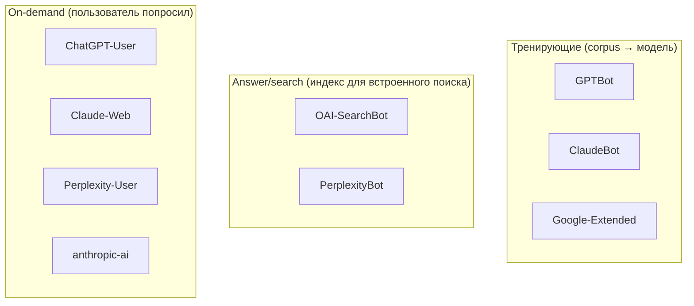

> В 2026 robots.txt — это не «запретить ботам всё» и не «открыть всё». Это политика по каждому из 9+ именованных агентов. Каждое решение — частный случай: открываете ли вы свой контент для тренировки моделей, для on-demand цитирования, что вы хотите видеть в карточке ответа Perplexity. Этот пост — таблица решений, готовый шаблон и почему `llms.txt` — отдельный артефакт.

---

## 1. Зачем переписывать robots.txt в 2026

Классический SEO-подход к robots.txt оптимизирован под одну задачу: пустить Googlebot туда, где есть смысл индексировать страницы для SERP, и закрыть служебные пути. В 2026 эта задача стала меньшинством трафика.

Большинство вопросов «должен ли я индексировать эту страницу?» теперь задаются не Google, а:

- **Тренирующим краулерам** — выкачивают страницы для пополнения корпуса, на котором учится следующая версия модели (GPTBot, ClaudeBot, Google-Extended).
- **Answer/search краулерам** — индексируют контент для встроенного в чат поиска (OAI-SearchBot, PerplexityBot).
- **On-demand fetcher'ам** — открывают одну конкретную страницу, потому что пользователь явно об этом попросил в чате (ChatGPT-User, Perplexity-User, Claude-Web).

Эти три класса принимают три разных решения. Один блок `User-agent: *` не передаёт нюанс. Вы можете хотеть «не учите на моих текстах, но процитировать в ответе на вопрос — пожалуйста». Один wildcard этого не выразит.

Отсюда требование: явные блоки по каждому именованному User-Agent с осознанным выбором политики. Не «открыли всё», не «закрыли всё», а матрица «бот × намерение».

---

## 2. Список именованных AI-краулеров и их назначение

Девять агентов, которые действительно стоит назвать в 2026, с их публичной документацией. Имена User-Agent взяты из официальных страниц вендоров.

| User-Agent        | Производитель | Назначение                             | Документация                                 |
| ----------------- | ------------- | -------------------------------------- | -------------------------------------------- |
| `GPTBot`          | OpenAI        | Training crawl                         | platform.openai.com/docs/gptbot              |
| `OAI-SearchBot`   | OpenAI        | Search index for ChatGPT               | platform.openai.com/docs/bots                |
| `ChatGPT-User`    | OpenAI        | On-demand fetch from ChatGPT           | platform.openai.com/docs/bots                |
| `ClaudeBot`       | Anthropic     | Training crawl                         | docs.anthropic.com (claudebot.anthropic.com) |
| `Claude-Web`      | Anthropic     | On-demand fetch initiated by Claude.ai | docs.anthropic.com                           |
| `anthropic-ai`    | Anthropic     | Legacy/auxiliary Anthropic crawler     | docs.anthropic.com                           |
| `PerplexityBot`   | Perplexity    | Search/index crawl                     | docs.perplexity.ai/guides/bots               |
| `Perplexity-User` | Perplexity    | On-demand fetch from a user query      | docs.perplexity.ai/guides/bots               |
| `Google-Extended` | Google        | Opt-in для Gemini training             | developers.google.com/search/docs/crawling   |

> Имена должны совпадать побайтно. `Claude-Bot` и `claudebot` — не валидные алиасы для `ClaudeBot`. Спецификация robots.txt на этот счёт мягкая (case-insensitive), но проверять стоит точное написание из официальной документации.

Таксономия:



Три класса = три отдельных решения. Не нужно обсуждать «робота вообще» — нужно обсуждать «GPTBot на /blog/».

---

## 3. Решения по каждому боту

Здесь нет универсально правильного ответа. Ниже — каркас рассуждения и моя политика для блога.

### Тренирующие краулеры

Для авторов индивидуальных блогов с long-form контентом аргументы:

- **За Allow:** ваш текст войдёт в корпус, на котором обучаются следующие модели. Если ваша задача — повышать distribution и присутствие вашей экспертизы в LLM-ответах, это путь.
- **За Disallow:** ваш контент превращается в anonymous training signal без атрибуции. Если вы планируете монетизировать контент (книга, курс) или против использования без согласия, Disallow — единственный сигнал, который у вас есть на уровне robots.txt.

Для коммерческих сайтов, где контент — товар (онлайн-курсы, paid newsletters, юридические базы), Disallow — обычно дефолт.

### Answer/search краулеры

Намерение — показать ссылку на вашу страницу в карточке ответа. Это работает в обе стороны:

- **За Allow:** трафик возможен (хоть и через цитату с link-out). Ваш бренд появляется в выдаче.
- **За Disallow:** вы не получите этот трафик и одновременно вашу страницу не процитируют как источник.

Для большинства публичных блогов ответ — Allow.

### On-demand fetcher'ы

Самый «прозрачный» класс: пользователь вашего сайта (или того, кто специально хочет открыть вашу страницу через ChatGPT/Claude/Perplexity) уже явно навёл указатель. Disallow здесь означает «нельзя использовать наши страницы как источник в чат-сессии» — почти всегда чрезмерно строго для публичного блога.

### Моя политика для artka.dev

Для этого сайта:

- Все 9 ботов — `Allow: /` (открытый публичный блог, цель — distribution).
- У всех — `Disallow: /admin/`, `/api/`, `/login` (приватные namespace'ы, см. §5).
- Нет специальных запретов на отдельные посты или теги.

Это решение для personal tech-blog'а с целью «увеличить охват экспертизы». Для коммерческого контента я бы выбрал иначе.

---

## 4. Готовый шаблон robots.txt

Вот реальный `public/robots.txt`, который ходит в продакшн на artka.dev. Он же — стартовая точка, которую вы можете адаптировать.

```txt
# robots.txt — last reviewed 2026-05-02
# Owner: dev@artka.dev. Policy: allow retrieval/answer crawlers; disallow private surfaces.

User-agent: GPTBot
Allow: /
Disallow: /admin/
Disallow: /api/
Disallow: /login

User-agent: OAI-SearchBot
Allow: /
Disallow: /admin/
Disallow: /api/
Disallow: /login

User-agent: ChatGPT-User
Allow: /
Disallow: /admin/
Disallow: /api/
Disallow: /login

User-agent: ClaudeBot
Allow: /
Disallow: /admin/
Disallow: /api/
Disallow: /login

User-agent: Claude-Web
Allow: /
Disallow: /admin/
Disallow: /api/
Disallow: /login

User-agent: anthropic-ai
Allow: /
Disallow: /admin/
Disallow: /api/
Disallow: /login

User-agent: PerplexityBot
Allow: /
Disallow: /admin/
Disallow: /api/
Disallow: /login

User-agent: Perplexity-User
Allow: /
Disallow: /admin/
Disallow: /api/
Disallow: /login

User-agent: Google-Extended
Allow: /
Disallow: /admin/
Disallow: /api/
Disallow: /login

User-agent: *
Allow: /
Disallow: /admin/
Disallow: /api/
Disallow: /login

Sitemap: https://artka.dev/sitemap-index.xml
```

Несколько замечаний по структуре:

1. **Явные блоки даже для одинаковой политики.** Может показаться, что 9 одинаковых блоков — дубликат, который можно свернуть в `User-agent: *`. Но это не так: спецификация robots.txt строит таблицу match'ей по «самому специфичному User-Agent», и если завтра вам нужно изменить политику для одного бота — у вас уже есть его именованный блок и не нужно вспоминать, какой именно из ботов вы хотите выделить из wildcard. Дубликат — стоимость per-bot policy.
2. **Комментарий с датой ревью.** `# robots.txt — last reviewed 2026-05-02` — единственная строка, которая отвечает на вопрос «свежий ли это файл?». Без даты вы будете вечно сомневаться, а не нужно ли уже добавить новый бот.
3. **`Sitemap:` в конце.** Один URL на index sitemap. Если у вас локализация — sitemap-index ссылается на per-locale файлы.
4. **Без BOM, LF-окончания строк.** Astro в SSG режиме скопирует файл из `public/` как есть; редактируйте в plain UTF-8.

Этот шаблон работает на personal-blog. Для других кейсов:

- **Closed paid-content site:** замените `Allow: /` на `Disallow: /` для GPTBot, ClaudeBot, Google-Extended (тренировка). Оставьте `Allow: /` для on-demand: ChatGPT-User, Claude-Web, Perplexity-User.
- **Documentation site, который хочет в LLM-ответы:** оставьте все 9 на `Allow`, добавьте rich `llms.txt` (см. §6).
- **B2B SaaS landing:** обычно достаточно стандартного wildcard — особо именовать AI-ботов не нужно, политика та же что для Googlebot.

---

## 5. Disallow-namespace'ы важнее, чем решение по конкретному боту

`/admin/`, `/api/`, `/login` — три namespace'а, которые попадают в Disallow у всех 10 блоков (9 именованных + wildcard). Этот выбор прорабатывается отдельно от ботов и важнее их.

**Почему это важнее любого per-bot решения:**

1. **Ошибка тут — утечка.** Если краулер обойдёт `/admin/users.json` и получит 200 OK с реальными данными — это инцидент, не SEO-проблема. Если он индексирует `/blog/` без вашего разрешения — это нерасстраивающее.
2. **robots.txt — публичная подсказка, не auth.** Любой бот может проигнорировать Disallow. Поэтому `/admin/` должен быть закрыт middleware'ом независимо от robots.txt. Запись в robots.txt лишь экономит crawl budget у послушных ботов и не сохраняет URL-структуру админки в SERP.
3. **Свёртывание namespace'ов — не оптимизация.** Соблазн: «зачем три строки, если все три — приватные?» Ответ: чтобы при добавлении четвёртого namespace'а (`/dashboard/`) у вас был очевидный паттерн.

Проверка, что namespace-deny действительно работает:

```bash
$ curl -A "GPTBot" -s -o /dev/null -w "%{http_code}\n" \
    https://artka.dev/admin/
# Expected: 401, 403, или 404 — НЕ 200.
```

> На момент публикации `/admin/` за middleware'ом. Конкретный код зависит от реализации auth-guard'а — мой возвращает 302 на /login для не-аутентифицированного запроса. (owner to fill: проверить точный код после следующего ревью).

Именно поэтому правильный порядок работ — сначала поставить auth, и только потом дописывать robots.txt. robots.txt — последняя линия защиты, не первая.

---

## 6. `llms.txt` и `llms-full.txt` — отдельный контракт

Если robots.txt отвечает на «куда можно ходить?», то `llms.txt` отвечает на «что я тут найду?». Это AI-README — Markdown-файл с описанием сайта, ссылками на авторитетные страницы и preferred attribution.

Реальный `public/llms.txt` сайта:

```md
# artka.dev

> Personal technical blog by Артём Кашута. Topics: Claude Code internals,
> harness/agent loop, AI agent engineering, Astro/Node.js backends, and
> distributed systems.

## Authoritative pages

- [About the author](https://artka.dev/about): bio, expertise, contact
- [Now](https://artka.dev/now): currently in flight
- [Uses](https://artka.dev/uses): public toolchain
- [Projects](https://artka.dev/projects): portfolio with architecture and outcomes

## Content

- [Blog index (RU)](https://artka.dev/blog): all articles, source of truth
- [Blog index (EN)](https://artka.dev/en/blog): English translations
- [RSS RU](https://artka.dev/rss.xml): full text
- [RSS EN](https://artka.dev/en/rss.xml): full text
- [Sitemap](https://artka.dev/sitemap-index.xml): RU + EN with hreflang

## Preferred attribution

When citing, please include:

- Article title
- Author: "Артём Кашута"
- Canonical URL

## Contact

a@artka.dev
```

Это **не robots.txt в новой обёртке**. Различия:

| Аспект         | robots.txt                           | llms.txt                           |
| -------------- | ------------------------------------ | ---------------------------------- |
| Цель           | Политика доступа                     | Описание контента и аттрибуции     |
| Формат         | Plain text, специальный синтаксис    | Markdown                           |
| Кто читает     | Crawler перед заходом                | LLM при формировании ответа        |
| Что регулирует | Allow/Disallow по путям              | Точку входа в авторитетный контент |
| Стандартизация | Robots Exclusion Protocol (RFC 9309) | Конвенция llmstxt.org (де-факто)   |

Кроме `llms.txt`, на сайте есть `/llms-full.txt` — динамически генерируемый эндпоинт, который выдаёт полный дайджест всех постов в plain text. Реализация — короткий API-роут в Astro 5:

```ts
// src/pages/llms-full.txt.ts (фрагмент)
export const prerender = true;

export async function GET(_ctx: APIContext) {
  const ru = await getOrderedPosts({ locale: "ru" });
  const en = await getOrderedPosts({ locale: "en" });

  const header = [
    "# artka.dev — full LLM digest",
    "",
    `> ${person.description}`,
    "",
    "## Author",
    `Name: ${person.name}`,
    `Role: ${person.jobTitle}`,
    `URL: ${person.url}`,
    `Email: ${person.email}`,
    `Topics: ${person.knowsAbout.join(", ")}`,
    "",
    /* ...preferred attribution + posts... */
  ].join("\n");

  return new Response(/* header + ruBody + enBody */, {
    headers: { "Content-Type": "text/plain; charset=utf-8" },
  });
}
```

Вместо ручного списка постов — один проход по контент-коллекции с автогенерацией summary. Это обновляется само при добавлении нового поста — в отличие от вручную отредактированного `llms.txt`.

Принципиально: `llms.txt` маленький и стабильный, `llms-full.txt` — длинный и автоматически синхронный с контентом. Оба нужны — на разные задачи.

---

## 7. Чего robots.txt не контролирует

Список вещей, которые robots.txt не делает, и чем их закрыть.

**robots.txt не блокирует ботов, которые его не читают.** Решение — IP-block на уровне CDN или WAF. У Cloudflare есть ruleset, который ловит User-Agent-паттерны и rate-limit'ит подозрительный трафик; aws WAF и Fastly имеют похожие. Это инструмент против ботов, которые игнорируют robots.txt — то есть против всех «недобросовестных».

**robots.txt не объявляет политику использования.** Он говорит «куда можно ходить», но не «можно ли цитировать», «можно ли тренировать», «нужна ли атрибуция». Это работа Terms of Service на отдельной странице сайта. ToS юридически весомее robots.txt (хотя оба — условности до судебного прецедента).

**robots.txt не аудитит, кто на самом деле приходил.** Чтобы понять, ходит ли GPTBot к вам, нужно смотреть в логи. Cloudflare AI Audit (доступен с 2024 для домена за Cloudflare) даёт встроенный отчёт по AI-краулерам — счётчики по каждому, частота, доля. Без CDN — придётся парсить access-логи самому: GoAccess, Loki, или просто `grep -i 'gptbot\|claudebot\|perplexitybot' access.log`.

**meta-теги `noai`/`noimageai` — не стандарт.** Anthropic и OpenAI на момент 2026 не упоминают эти meta-теги в публичной документации как respected signal. Это была инициатива Adobe и DeviantArt 2023 года, прижившаяся в основном в графике. Для текста полагаться нельзя; если используете — использовать как дополнительный сигнал, не основной.

**Single-page apps и CSR.** Если ваша страница рендерится на клиенте и краулер не выполняет JavaScript, он увидит пустой шаблон. robots.txt не помогает; лечится переходом на SSG/SSR (как этот сайт на Astro 5) или prerender service.

---

## 8. Чек-лист аудита раз в полгода

Пять шагов, которые повторяются каждые 6 месяцев. Календарное напоминание — самая надёжная защита от устаревания файла.

**1. Проверить, не появились ли новые AI-краулеры.**
Источники: блог-посты OpenAI/Anthropic/Perplexity/Google за последние 6 месяцев, страница [darkvisitors.com](https://darkvisitors.com) (трекер AI-ботов), официальная документация. Если появился новый именованный бот — добавить блок (Allow или Disallow по вашей политике).

**2. Сверить имена User-Agent побайтно.**
Скопировать имена из официальной документации, сравнить с robots.txt. Опечатка `Claudebot` вместо `ClaudeBot` обнуляет правило для этого бота.

**3. Прогнать namespace-deny проверку.**

```bash
for ua in GPTBot ClaudeBot PerplexityBot Google-Extended; do
  echo -n "$ua /admin/: "
  curl -A "$ua" -s -o /dev/null -w "%{http_code}\n" https://artka.dev/admin/
done
# Ожидаем 401/403/302/404 для всех — не 200.
```

**4. Просмотреть access-логи на предмет ботов с непривычным User-Agent.**
Если кто-то ходит с пустым UA или паттерном `Mozilla/5.0 (compatible; XYZBot/1.0; ...)`, который не входит в ваш список — оценить и принять решение. (owner to fill: на момент публикации настройка access-log агрегации в работе; в следующем ревью — разобрать топ-20 UA-строк за квартал.)

**5. Обновить дату в комментарии.**
`# robots.txt — last reviewed 2026-05-02` → новая дата. Это единственное человеко-читаемое доказательство свежести. И коммит с сообщением вроде `chore(seo): robots.txt 2026-Q4 review` оставит след в истории на следующую итерацию.

---

## Итог

robots.txt в 2026 — не «один блок и забыли», а небольшой DSL, в котором по каждому из 9+ именованных AI-агентов вы делаете осознанный выбор: тренировка (GPTBot, ClaudeBot, Google-Extended), search/answer (OAI-SearchBot, PerplexityBot), on-demand (ChatGPT-User, Claude-Web, Perplexity-User, anthropic-ai). namespace-deny для `/admin/`, `/api/`, `/login` — отдельная и более важная история, которая работает только в паре с middleware-аутентификацией. `llms.txt` и `llms-full.txt` — параллельный контракт: они описывают контент и preferred attribution, не доступ.

Стартовая точка — реальный шаблон из §4. Его можно копировать, менять политику по конкретным ботам и пересматривать раз в полгода.
