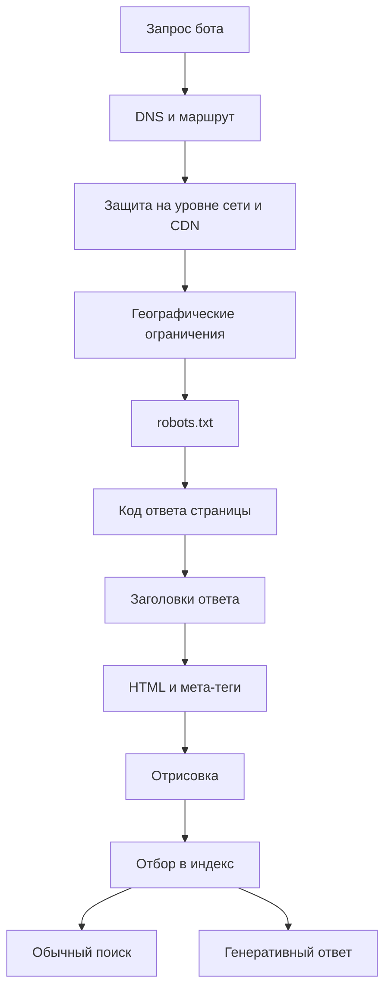

> Разрешение GPTBot не управляет показом в ChatGPT. Google-Extended не управляет попаданием в AI Overviews. А ваш CDN может закрывать доступ роботам, и в robots.txt этого не видно. За лето 2026 у задачи «пустить или не пустить робота» появился четвёртый рычаг и целый слой управления на уровне сети. Разбираю, что за что отвечает на сентябрь 2026, с опорой на документацию владельцев ботов, а не на чужие подборки.

---

## 1. Задач четыре, а не три

Прошлая версия этой статьи разделяла три задачи. Их стало четыре: Google развёл обычный поиск и генеративные ответы поиска по разным рычагам.

| Задача                                     | Чем управлять                                                |
| ------------------------------------------ | ------------------------------------------------------------ |
| Показ в обычном поиске Google              | Googlebot в robots.txt, код ответа, noindex, canonical       |
| Показ в AI Overviews и AI Mode             | Настройка Search generative AI в Search Console, nosnippet   |
| Использование для обучения моделей         | Правила обучающего бота (GPTBot, ClaudeBot, Google-Extended) |
| Получение страницы по запросу пользователя | Почти ничем: такие боты robots.txt часто не соблюдают        |

Настройка Search generative AI раскатана на все сайты мира 31 августа 2026. Она покрывает AI Overviews, AI Mode и генеративные функции в Discover, принимает три значения (включать, исключать, наследовать от родительского ресурса) и вступает в силу за несколько дней. Google отдельно оговаривает: «This control only affects whether your content can appear in certain Search generative AI features; this control isn't used as a ranking or inclusion signal affecting other parts of Search».

Для отдельных кусков страницы есть рычаг точнее. Директива `nosnippet` и атрибут `data-nosnippet` теперь описаны как запрет использовать текст «as a direct input for AI Overviews and AI Mode».

Четвёртая строка таблицы самая неприятная, потому что рычага в ней почти нет. У OpenAI про ChatGPT-User написано: «Because these actions are initiated by a user, robots.txt rules may not apply». У Meta про Meta-ExternalFetcher: «may bypass robots.txt because it performs fetches that were requested by the user». У Perplexity про Perplexity-User: «generally ignores robots.txt rules». Это не нарушение с их стороны, это заявленное поведение.

---

## 2. Кто есть кто на сентябрь 2026

Таблица собрана только по документации владельцев ботов. Имена из чужих подборок сюда не попали.

| Владелец   | Обучение              | Поиск и индексация | Запрос пользователя   | Прочее           |
| ---------- | --------------------- | ------------------ | --------------------- | ---------------- |
| OpenAI     | GPTBot                | OAI-SearchBot      | ChatGPT-User          | OAI-AdsBot       |
| Anthropic  | ClaudeBot             | Claude-SearchBot   | Claude-User           |                  |
| Google     | Google-Extended       | Googlebot          | Google-Agent и другие | AdsBot, Storebot |
| Perplexity | не используют         | PerplexityBot      | Perplexity-User       |                  |
| Amazon     | Amazonbot             | Amzn-SearchBot     | Amzn-User             |                  |
| Mistral    | MistralAI-Training    | MistralAI-Index    | MistralAI-User        |                  |
| Meta       | Meta-ExternalAgent    | Meta-WebIndexer    | Meta-ExternalFetcher  | Meta-ExternalAds |
| Apple      | Applebot (смешанный)  | Applebot           |                       | iTMS             |
| Microsoft  | нет отдельного токена | Bingbot            |                       |                  |

Главное в этой таблице не имена, а разделение. У OpenAI, Anthropic, Amazon, Mistral, Meta и Perplexity задачи разведены по разным ботам, и отказ от обучения не задевает поиск. У Apple, Google и Microsoft один бот делает и то, и другое, поэтому отдельного рычага нет и приходится пользоваться надстройками.

Про Apple это сказано прямо: «The data crawled by Applebot may also be used to help train Apple foundation models powering generative AI features». Именно поэтому у них есть Applebot-Extended: он не влияет на присутствие в поиске, а только запрещает использование для обучения.

У Microsoft отдельного токена для обучения нет вовсе, управление идёт мета-тегами: `NOARCHIVE` означает, что содержимое не попадёт ни в ответы Bing Chat, ни в обучение, `NOCACHE` разрешает показ ответом с адресом, заголовком и фрагментом.

Четыре замечания, которые стоят отдельно.

**Google-Extended переехал** со страницы особых случаев на страницу обычных краулеров и получил точную формулировку: «training future generations of Gemini models», и «does not impact a site's inclusion in Google Search nor is it used as a ranking signal in Google Search».

**OAI-AdsBot появился недавно** и на него robots.txt не распространяется. Рекламодателям OpenAI отдельно пишет: «You must allow OAI-AdsBot».

**У Cohere активных краулеров нет.** Дословно: «We do not use Cohere bots or user agents for the purpose of crawling or scraping web content to train generative AI foundation models at this time». Если появятся, токен будет `Coherebot`. Группа `cohere-ai` в чьём-либо файле сегодня не значит ничего.

**У Bytespider первоисточника нет.** Ни на сайте ByteDance, ни на сайте TikTok страницы с описанием краулера найти не удалось. Имя ходит только по сторонним каталогам. Если оно стоит в вашем файле, вы не можете проверить, что оно правильное.

---

## 3. Что решает сеть, пока вы правите файл

Это тот слой, которого в прошлой версии статьи не было совсем, а за 2025 и 2026 годы он стал решающим.

Cloudflare в сентябре 2025 объявил Content Signals Policy: три сигнала прямо в robots.txt со значениями да или нет.

```text
User-Agent: *
Content-Signal: search=yes, ai-train=no
Disallow: /admin/
```

Клиентам управляемого robots.txt, а это 3,8 миллиона доменов, значения `search=yes, ai-train=no` выставили централизованно. Позже добавился третий сигнал `use` со значениями `immediate` (без хранения), `reference` (индексация со ссылкой) и `full` (пересказ и воспроизведение).

С 1 июля 2026 вместо одного выключателя «блокировать ИИ-ботов» появились три категории: Search, Agent, Training. Доступно на всех тарифах, включая бесплатный.

Дальше самое важное для владельца сайта. **С 15 сентября 2026 у новых доменов поменялись значения по умолчанию**: боты категорий Training и Agent блокируются на страницах с рекламой, Search остаётся разрешённым. Существующие клиенты сохраняют свои настройки, но прежняя опция «Block AI bots» помечена как устаревающая.

Отсюда практический вывод: сайт может быть полностью открыт в robots.txt и при этом закрыт на уровне сети. По самому файлу этого не увидеть никак.

В августе 2026 добавился Bot Preference Sync: настройки категорий переносятся в robots.txt, дописывая правила поверх существующих. Для новых клиентов включается по умолчанию. То есть ваш файл может измениться не вашими руками.

И отдельная настройка «Disallow AI Training» для смешанных краулеров, появившаяся 15 сентября 2026. Она решает ровно ту проблему из второго раздела: у Apple, Google и Microsoft один бот делает и поиск, и обучение, поэтому блокировка обучения раньше выбивала сайт из поиска. Cloudflare завёл критерии «Accountable», их четыре: отказ от обучения через robots.txt, отказ от использования в ИИ-сводках, видимость на уровне адресов, и гарантия, что отказ от обучения не повлияет на обычный поиск.

Про то, что правила соблюдают не все, есть задокументированный случай. В августе 2025 Cloudflare зафиксировал у Perplexity необъявленные краулеры с обычной строкой браузера и адресами вне официального списка, с ротацией по разным автономным системам, и исключил компанию из реестра проверенных ботов. Объявленный Perplexity-User давал 20 до 25 миллионов запросов в сутки, скрытый от 3 до 6 миллионов. Common Crawl со своей стороны отдельно предупреждает о подделках под CCBot.

Вывод, который стоит проговорить прямо: robots.txt это просьба, а не защита. Для закрытого содержимого нужна аутентификация.

---

## 4. Куда движется стандарт

Сам robots.txt стандартизирован в 2022 году как RFC 9309, и это не черновик, а Internet Standards Track. Оттуда полезно знать три вещи: кеш не дольше 24 часов, лимит разбора не менее 500 килобайт, и при ответе 5xx краулер «MUST assume complete disallow».

Дальше начинаются черновики, и их стоит различать.

Рабочая группа IETF aipref готовит два основных документа. Первый, `draft-ietf-aipref-vocab`, вводит три категории: `train-ai` (изменение обучаемых параметров модели), `ai-use` (подача материала на вход модели, когда его предоставил не пользователь) и `search`. Значения `y` и `n`, плюс третье состояние «неизвестно», и правило самого строгого: если хоть один источник запрещает, значит запрещено. Второй, `draft-ietf-aipref-attach`, вводит заголовок ответа `Content-Usage` и одноимённое правило в robots.txt, которое можно привязать к пути:

```text
Content-Usage: train-ai=n
```

Среди авторов Gary Illyes из Google и Martin Thomson из Mozilla. Но это черновики, и сама спецификация оговаривает, что выражение предпочтения не гарантирует его соблюдения. Ни один владелец бота публично не заявил, что читает `Content-Usage` или `Content-Signal`.

Отдельная линия, уже работающая: подписи запросов. С мая 2026 у Google есть руководство по Web Bot Auth, и часть запросов Google-Agent подписывается криптографически по RFC 9421. В ответе появляются заголовки `Signature-Agent`, `Signature` и `Signature-Input`, ключи лежат по фиксированному адресу. Google честно оговаривает границы: «Not all Google user agents are using Web Bot Auth» и «Google is not yet signing every request of agents using the protocol». Заодно любопытная деталь: сам протокол подписей это индивидуальный черновик без рабочей группы IETF, а не стандарт.

Для практики это меняет одно: подмена строки User-Agent через curl не просто ничего не доказывала раньше, теперь она отстаёт от происходящего ещё сильнее.

---

## 5. Почему noindex нельзя прятать за Disallow

Это остаётся самой частой ошибкой, и механика простая. Чтобы прочитать директиву `noindex` в HTML, робот должен получить страницу. Если обход запрещён в robots.txt, директива останется непрочитанной. Google формулирует это прямо: «For the noindex rule to be effective, the page or resource must not be blocked by a robots.txt file».

Поэтому внутренний поиск на сайте остаётся открытым для обхода и закрывается через `noindex`. Это два разных решения с разными целями, и они не взаимозаменяемы.

Рядом стоит знать, как коды ответа читаются в двух разных контекстах.

| Код | На сам robots.txt                               | На обычную страницу                          |
| --- | ----------------------------------------------- | -------------------------------------------- |
| 2xx | правила применяются                             | обычная обработка                            |
| 4xx | считается, что файла нет, обход открыт целиком  | адрес удаляется из индекса                   |
| 429 | приравнивается к серверной ошибке               | признак перегрузки, обход замедляется        |
| 5xx | 12 часов обхода нет, затем 30 дней старая копия | частота обхода падает, адреса выпадают позже |

Две ловушки здесь заслуживают отдельного упоминания. Ошибка 5xx на служебном файле останавливает обход всего сайта на полсуток. А ошибка 4xx на нём означает не «закрыто», а «открыто целиком»: рассчитывать, что при недоступном robots.txt робот будет осторожничать, нельзя.

Ещё одна ловушка касается именованных групп. Применяется ровно одна группа, самая точная по совпадению имени, и группы не объединяются с группой `*`. Если вы завели отдельную группу для GPTBot и написали в ней только `Allow: /`, то `Disallow: /admin/` из общей группы на него больше не действует. Это надо помнить при каждом добавлении имени.

Обратная сторона того же правила бывает полезна. На artka.dev правило `Disallow: /*.md$` намеренно стоит только в общей группе: оно закрывает markdown-копии статей для обычных поисковых роботов и не трогает перечисленные выше группы ИИ-агентов, которым эти копии как раз удобны.

---

## 6. Когда робот всё равно не доходит

Разрешение в robots.txt это одна точка на длинном пути. Отказать могут в любой другой.



Порядок проверки, снизу вверх по частоте, с чем я реально сталкивался и что подтверждается документацией:

1. **Значения по умолчанию у CDN.** С 15 сентября 2026 новые домены Cloudflare блокируют категории Training и Agent на страницах с рекламой. В robots.txt этого не видно.
2. **Ответ 403 от защиты от ботов.** Для Google это обычная ошибка 4xx, и проиндексированные адреса из индекса удаляются. Типичный источник: правило прокси, срабатывающее на незнакомую строку User-Agent.
3. **Географические ограничения.** Googlebot обходит сайт с адресов и внутри США, и за их пределами. Если сервер ведёт себя по-разному, robots.txt и мета-теги «must specify the same rules in each locale».
4. **Ошибка 5xx на robots.txt.** Полсуток тишины, затем месяц на старой копии.
5. **Именованная группа, перекрывшая общую.** См. предыдущий раздел.

Как проверять по-настоящему. Обычный GET, не HEAD:

```bash
curl -sS -D /tmp/headers.txt https://artka.dev/blog/ -o /tmp/page.html
```

В заголовках смотрим статус и отсутствие нежелательного `X-Robots-Tag`, в HTML собственный canonical и отсутствие нежелательного meta robots. Если есть переадресация, проверяем и конечный адрес: первый 301 умеет вести на 404.

Дальше три способа подтвердить, что перед вами настоящий робот, а не подделка:

| Владелец     | Обратный DNS | Файл со списком адресов       | Подпись запроса |
| ------------ | ------------ | ----------------------------- | --------------- |
| Google       | да           | да, несколько файлов по видам | частично        |
| Anthropic    | нет          | да, один общий файл           | нет             |
| OpenAI       | нет          | да, по файлу на каждого бота  | нет             |
| Common Crawl | да           | да                            | нет             |

У Google разрешённые домены для обратной проверки это `googlebot.com`, `google.com` и `googleusercontent.com`, и проверять надо в обе стороны. У Anthropic обратный DNS не работает вовсе: я открыл их файл со списком, там 26 префиксов IPv4, принадлежащих Google Cloud, Azure и AWS, и имён ботов в файле нет. Годится только сверка по списку.

Отдельный инструмент появился в июне 2026: отчёты по генеративному ИИ в Search Console, раскатанные на все сайты к 31 августа. Важное ограничение: там только показы. Кликов нет, запросов как измерения нет.

---

## 7. llms.txt: что известно на сентябрь 2026

Формат живёт: в августе 2026 вышла вторая версия спецификации, где появилось обнаружение через `rel="alternate" type="text/markdown"` и `rel="describedby"`, разрешены оба способа адресации Markdown-копий и формально описано наследование по путям.

Про Google ясность полная, и она отрицательная. В руководстве по генеративным функциям поиска: «You don't need to create new machine readable files, AI text files, markup, or Markdown to appear in Google Search», и отдельно про llms.txt: «Doing so will neither harm nor help your site's visibility or rankings in Google Search, as Google Search ignores them». В январе 2026 John Mueller ответил на вопрос, означает ли наличие такого файла на сайтах Google одобрение формата: «I'm tempted to say something snarky since this has come up so often, but to be direct, no».

В Chrome появилась экспериментальная категория Lighthouse под названием Agentic Browsing, и в ней есть аудит llms.txt. Деталь, которую обычно пересказывают неверно: если файла нет, аудит помечается как неприменимый, а не проваленный. Провал бывает только при ошибке сервера. То есть Lighthouse не награждает за наличие файла и не наказывает за отсутствие.

OpenAI, Anthropic и Google публикуют llms.txt для собственной документации для разработчиков. Это не значит, что их краулеры читают чужие: официального заявления о потреблении формата нет ни у одного из них.

Вывод для владельца сайта: как каталог материалов для агентов, которые умеют его читать, файл полезен. Как рычаг поисковой видимости он не работает, и ждать от него роста бессмысленно.

---

## 8. Что делать с собственным файлом

Короткий порядок, вытекающий из всего выше.

Сначала решите, какие из четырёх задач вам вообще важны. Для личного технического блога обычный ответ: показ в поиске нужен, показ в генеративных ответах нужен, обучение моделей допустимо, получение по запросу пользователя всё равно не контролируется.

Потом напишите файл под это решение, а не под список имён. Базовая политика умещается в шесть строк:

```text
User-agent: *
Allow: /
Disallow: /admin/
Disallow: /api/

Sitemap: https://artka.dev/sitemap-index.xml
```

Именованные группы добавляйте только тогда, когда политика для этого бота отличается от общей. Каждая такая группа должна быть полной: ограничения из `*` в неё не наследуются.

Проверьте имена по документации владельца. Подборки ботов в чужих блогах устаревают быстрее, чем обновляются: у меня в файле до сегодняшнего дня жила группа `cohere-ai`, которой в документации Cohere не существует.

И проверьте слой, который в файле не виден: настройки CDN, поведение защиты от ботов, коды ответа на сам robots.txt. Открытый файл при закрытой сети выглядит точно так же, как открытый файл при открытой сети.

Действующая политика этого сайта лежит в [robots.txt](/robots.txt), каталог материалов для агентов в [llms.txt](/llms.txt).

---

## Итог

За лето 2026 управление доступом перестало умещаться в один файл. У Google появился отдельный рычаг для генеративных ответов, у CDN появились категории ботов и значения по умолчанию, которые меняются без вашего участия, а в IETF пишут словарь предпочтений, который пока никто не обязан соблюдать. Владельцы ботов при этом разъехались: у половины задачи разведены по разным именам, у другой половины один бот делает всё сразу.

Практический вывод не поменялся, но стал жёстче. Список разрешённых имён в robots.txt это не политика доступа, а её малая часть. Политика начинается с ответа на вопрос, какие из четырёх задач вам нужны, и заканчивается проверкой того, что робот действительно получает страницу. Между этими двумя точками файл robots.txt отвечает примерно за треть пути. Если страница уже просканирована, все рычаги из этой статьи вы прошли, и дальше вопрос [совсем в другом](/blog/crawled-not-indexed-astro-audit/).

---

**Источники:**

- [OpenAI: боты](https://developers.openai.com/api/docs/bots) — GPTBot, OAI-SearchBot, ChatGPT-User, OAI-AdsBot
- [Anthropic: обход веба](https://support.claude.com/en/articles/8896518-does-anthropic-crawl-data-from-the-web-and-how-can-site-owners-block-the-crawler) — ClaudeBot, Claude-SearchBot, Claude-User
- [Google: обычные краулеры](https://developers.google.com/crawling/docs/crawlers-fetchers/google-common-crawlers) — формулировка про Google-Extended
- [Google: настройка Search generative AI](https://support.google.com/webmasters/answer/16908024) — раскатка на все сайты 31 августа 2026
- [Google: мета-теги для роботов](https://developers.google.com/search/docs/crawling-indexing/robots-meta-tag) — nosnippet как вход для AI Overviews
- [Google: спецификация robots.txt](https://developers.google.com/crawling/docs/robots-txt/robots-txt-spec) — коды ответа, лимит 500 килобайт, одна группа
- [Google: блокировка индексации](https://developers.google.com/search/docs/crawling-indexing/block-indexing) — почему noindex нельзя прятать за Disallow
- [Google: подтверждение запросов](https://developers.google.com/crawling/docs/crawlers-fetchers/verify-google-requests) — обратный DNS и списки адресов
- [Google: Web Bot Auth](https://developers.google.com/crawling/docs/crawlers-fetchers/web-bot-auth) — подписи запросов, границы применения
- [Google: руководство по генеративным функциям](https://developers.google.com/search/docs/fundamentals/ai-optimization-guide) — про llms.txt и машиночитаемые файлы
- [Apple: Applebot](https://support.apple.com/en-us/119829) — смешанное назначение и Applebot-Extended
- [Amazon: Amazonbot](https://developer.amazon.com/amazonbot) — Amzn-SearchBot и Amzn-User
- [Mistral: боты](https://docs.mistral.ai/robots) — разделение на три задачи
- [Meta: краулеры](https://developers.facebook.com/documentation/sharing/webmasters/web-crawlers) — Meta-WebIndexer и Meta-ExternalAds
- [Perplexity: боты](https://docs.perplexity.ai/guides/bots) — PerplexityBot и Perplexity-User
- [Cohere: краулеры](https://docs.cohere.com/docs/cohere-web-crawlers) — активных краулеров нет
- [Cloudflare: Content Signals Policy](https://blog.cloudflare.com/content-signals-policy/) — три сигнала в robots.txt
- [Cloudflare: категории ботов](https://developers.cloudflare.com/bots/additional-configurations/block-ai-bots/) — значения по умолчанию с 15 сентября 2026
- [Cloudflare: смешанные краулеры](https://blog.cloudflare.com/accountable-mixed-use-ai-crawlers/) — критерии Accountable
- [Cloudflare: скрытые краулеры Perplexity](https://blog.cloudflare.com/perplexity-is-using-stealth-undeclared-crawlers-to-evade-website-no-crawl-directives/) — случай августа 2025
- [RFC 9309](https://www.rfc-editor.org/rfc/rfc9309.html) — стандарт robots.txt
- [IETF aipref](https://datatracker.ietf.org/wg/aipref/documents/) — черновики словаря предпочтений и заголовка Content-Usage
- [llmstxt.org](https://llmstxt.org/) — спецификация, версия 2 от августа 2026
- [Chrome Lighthouse: Agentic Browsing](https://developer.chrome.com/docs/lighthouse/agentic-browsing/llms-txt) — как оценивается llms.txt
